<!-- beyondBINARY quantum-prefixed | uvspeed | {+1, 1, -1, +0, 0, -0, +n, n, -n} -->

<p align="center">

</p>

> A development platform built on the beyondBINARY prefix system `{+1, 1, -1, +0, 0, -0, +n, n, -n, +2, +3}` — structurally addressing code with 11 symbols across 20+ languages, each mapping to a quantum gate.

[](#install)
[](#quantum-prefix-system)
[](https://github.com/sponsors/fornevercollective)
[](LICENSE)
[](https://fornevercollective.github.io/uvspeed/web/quantum-notepad.html)

**Built with:**


**[Prefix/QuantumGutter](https://fornevercollective.github.io/uvspeed/web/quantum-gutter.html)** · **[notePad](https://fornevercollective.github.io/uvspeed/web/quantum-notepad.html)** · **[hexTerm](https://fornevercollective.github.io/uvspeed/web/terminal.html)** · **[hexCast](https://fornevercollective.github.io/uvspeed/web/hexcast.html)** · **[FREYAunits](https://fornevercollective.github.io/uvspeed/web/freya.html)** · **[brotherNumsy](https://fornevercollective.github.io/uvspeed/web/brothernumsy.html)** · **[kBatch](https://fornevercollective.github.io/uvspeed/web/kbatch.html)** · **[HexBench](https://fornevercollective.github.io/uvspeed/web/hexbench.html)** · **[ArchFlow](https://fornevercollective.github.io/uvspeed/web/archflow.html)** · **[gpu/cpu](https://fornevercollective.github.io/uvspeed/web/blackwell.html)** · **[Dashboard](https://fornevercollective.github.io/uvspeed/web/github-dashboard.html)** · **[Sponsor](https://fornevercollective.github.io/uvspeed/web/sponsor.html)**

---

## Preview

<p align="center">

</p>
<p align="center"><em>Quantum Notepad — prefix gutter, convert timeline, 3D navigation, stream history</em></p>

<details>
<summary><b>More screenshots (click to expand)</b></summary>

<p align="center">
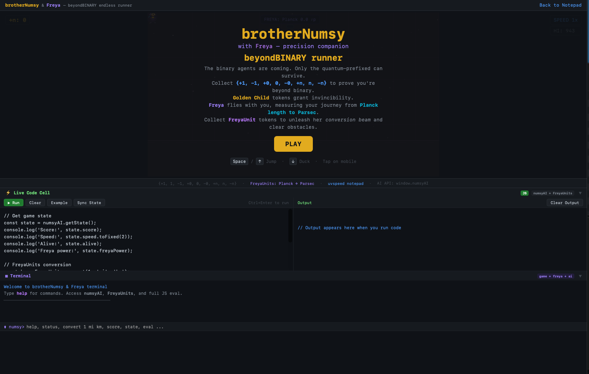
</p>
<p align="center"><em>brotherNumsy & Freya — endless runner with pixel-art sprites and AI training API</em></p>

<p align="center">
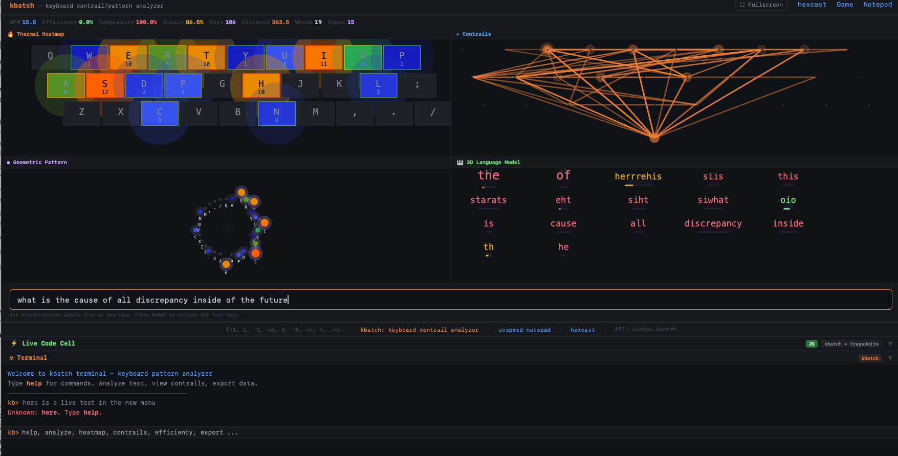
</p>
<p align="center"><em>kbatch — keyboard heatmap with thermal contrails and rainbow key lighting</em></p>

<p align="center">
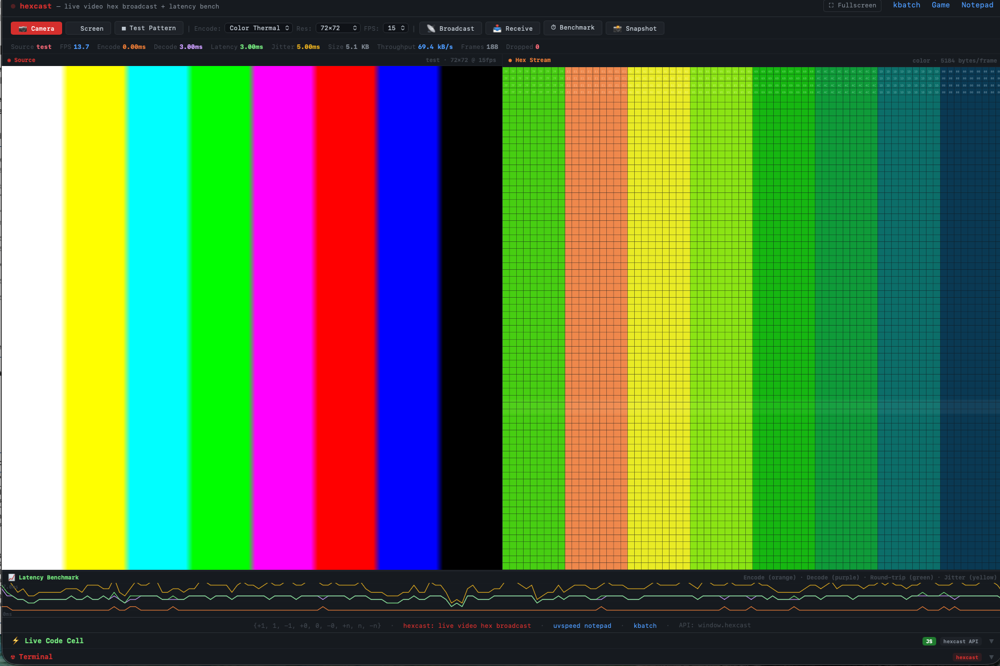
</p>
<p align="center"><em>hexcast — camera → terminal video streaming with truecolor ANSI rendering</em></p>

<p align="center">
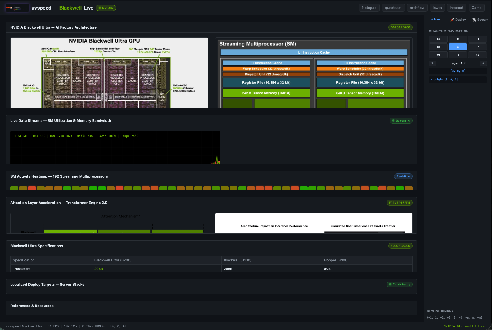
</p>
<p align="center"><em>Blackwell Live — NVIDIA data viz with SM heatmaps and deploy targets</em></p>

<p align="center">
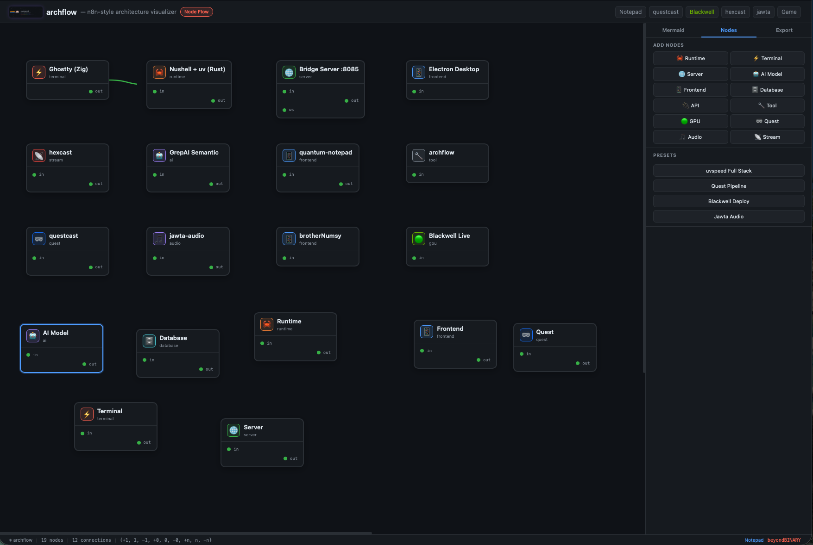
</p>
<p align="center"><em>archflow — n8n-style drag-and-drop architecture node visualizer</em></p>

<p align="center">
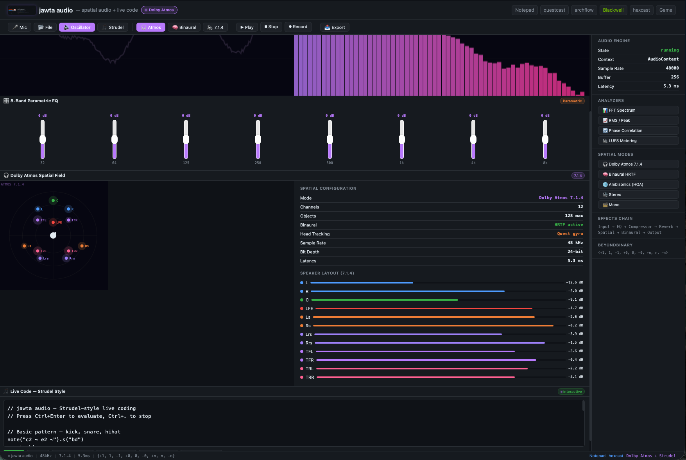
</p>
<p align="center"><em>jawta-audio — Dolby Atmos spatial audio + Strudel live coding</em></p>

<p align="center">
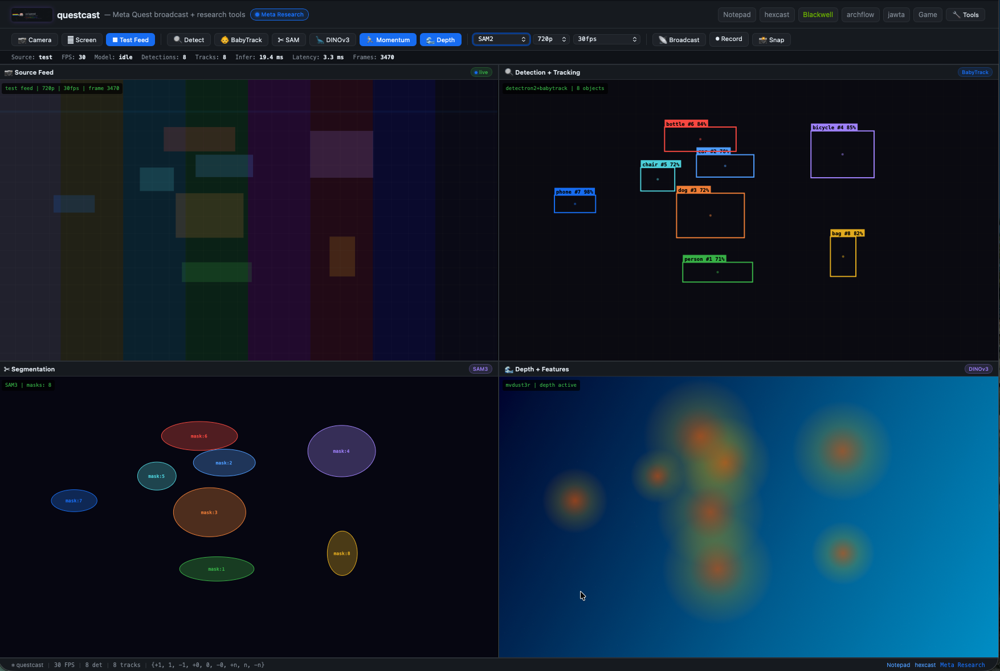
</p>
<p align="center"><em>questcast — Meta Quest broadcast + research tools</em></p>

<p align="center">

</p>
<p align="center"><em>Inspect — convert timeline bar with prefix version history</em></p>

<p align="center">

</p>
<p align="center"><em>Language benchmarks — 20 languages with prefix classification accuracy</em></p>

<p align="center">

</p>
<p align="center"><em>Prefix everything — 11 symbols structurally addressing any codebase</em></p>

<p align="center">

</p>
<p align="center"><em>Quantum navigation — 3D spatial code navigation with orb visualization</em></p>

<p align="center">

</p>
<p align="center"><em>Nyan cat hex stream — pixel-art characters in the starfield</em></p>

<p align="center">
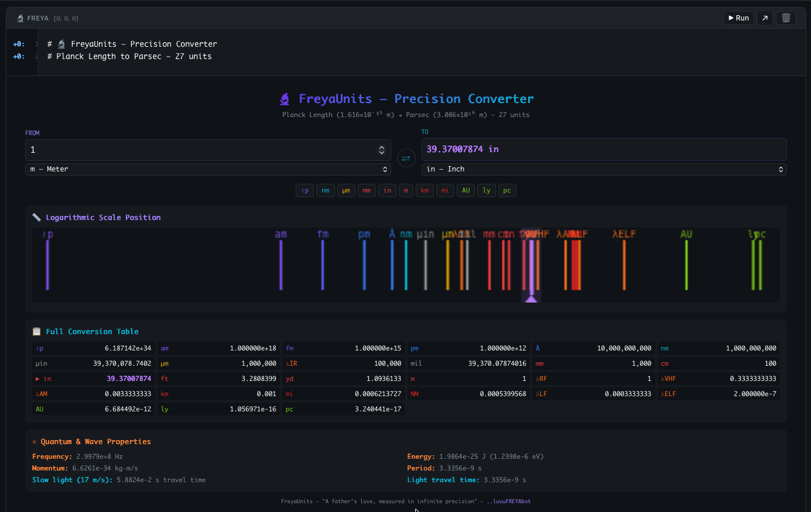
</p>
<p align="center"><em>FreyaUnits — 27-unit precision converter (Planck length → Parsec)</em></p>

<p align="center">

</p>
<p align="center"><em>Mermaid diagrams — inline architecture visualization in the notepad</em></p>

<p align="center">

</p>
<p align="center"><em>IDE integration — Cursor rules, VS Code, Copilot, Windsurf, MCP server</em></p>

<p align="center">
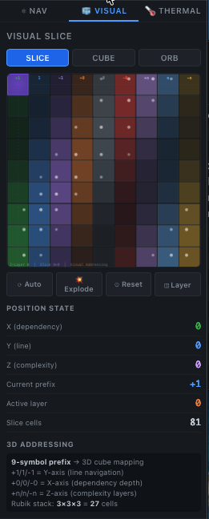
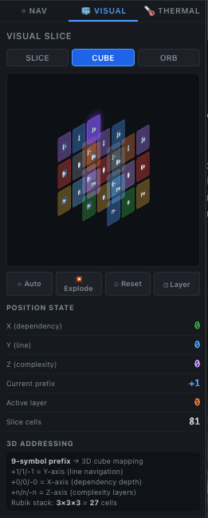
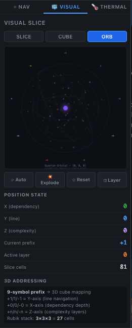
</p>
<p align="center"><em>Visual Slice / 3D Rubik's Cube / Quantum Orbital — 3 modes of spatial code navigation</em></p>

</details>

---

## What's Inside

uvspeed is a collection of developer tools unified by the quantum prefix system. Everything runs in the browser (zero install) or as a native Tauri desktop app.

### Desktop App (Tauri)

The launcher opens three modes:

| Mode | Description |
|------|-------------|
| **Instance** | Full terminal (`hexterm`) with individual feed windows per stream |
| **Grid View** | Single-canvas multi-stream grid — click any cell to open as individual instance |
| **Web** | Opens browser PWA — works on phone, tablet, desktop |

Plus a `{dev}` launch mode that opens the terminal with the dev console active.

### Web Tools

| Tool | What it does |
|------|-------------|
| **[quantum-gutter](web/quantum-gutter.html)** | Prefix system showcase — interactive 3D prefix cube, inverse starfield, live editor, benchmarks, visual slice/orb/hex stream, 20-language coverage |
| **[quantum-notepad](web/quantum-notepad.html)** | Code notepad with prefix gutter, 20-language support, mermaid diagrams, HexStream chat, GPU<>Q sidebar, 8-mode live heatmaps (treemap/bubble/bars/sunburst/orb/lattice/cube/slice), quantum 3D navigation |
| **[terminal (hexterm)](web/terminal.html)** | Full terminal emulator — virtual FS, hexcast, kbatch, device presets, sync, gutter |
| **[feed](web/feed.html)** | Lightweight video/audio feed window with speech-to-text transcript |
| **[grid](web/grid.html)** | Multi-stream canvas with 2x2/3x3/4x4 layout, device management, dev console |
| **[launcher](web/launcher.html)** | Mode picker + command console for controlling all connected devices |
| **[brotherNumsy](web/brothernumsy.html)** | Endless runner game with AI training API and FreyaUnits converter |
| **[kbatch](web/kbatch.html)** | Keyboard heatmap analyzer — thermal contrails, geometric patterns, WebSocket sync |
| **[hexcast](web/hexcast.html)** | Camera → hex video broadcast — 4 encode modes, latency benchmarks |
| **[hexcast-send](web/hexcast-send.html)** | Mobile PWA for streaming phone camera to a remote hexcast receiver |
| **[blackwell](web/blackwell.html)** | NVIDIA Blackwell data visualization + deploy targets (DGX Spark, Lambda) |
| **[questcast](web/questcast.html)** | Meta Quest broadcast + research tools |
| **[archflow](web/archflow.html)** | n8n-style architecture node visualizer with mermaid export |
| **[jawta-audio](web/jawta-audio.html)** | Spatial audio + Strudel live coding |
| **[hexbench](web/hexbench.html)** | Voltage lab — PSU monitor, Arduino code editor, node workbench, Pybricks builder |
| **[research-lab](web/research-lab.html)** | Markdown research editor with node canvas, mermaid preview, console |
| **[freya](web/freya.html)** | Galactic unit converter, scientific calculator, celestial charts, quantum geo navigation |
| **[numsy](web/numsy.html)** | 1080x1080 Instagram visual generator |
| **[sponsor](web/sponsor.html)** | Sponsor page with Rubik's cube, inverse starfield, Numsy sprites, tier cards |
| **[github-dashboard](web/github-dashboard.html)** | Project health dashboard — phases, deps, community, actions |

### Shared Modules

| Module | Description |
|--------|-------------|
| **[quantum-prefixes.js](web/quantum-prefixes.js)** | Shared prefix API — `classifyLine()`, `prefixContent()`, cross-app `BroadcastChannel` sync, IoT WebSocket bridge, global light/dark theme engine |
| **[sw.js](web/sw.js)** | Service worker — offline-first cache for all 20 apps + shared assets |

### CLI Tools

| Tool | Install | Description |
|------|---------|-------------|
| **hexcast** | `pip install uvspeed-quantum` | Camera → terminal video streaming (truecolor ANSI) |
| **hexcast --receive** | same | WebSocket server that renders incoming frames |
| **hexcast --serve** | same | Start camera WebSocket server for remote viewers |
| **uvspeed-bridge** | same | Quantum bridge server (55+ API endpoints) |

---

## Install

### Zero install (browser)

Just open any HTML file in `web/` — they're all standalone PWAs:

```bash
open web/quantum-notepad.html
# or visit: https://fornevercollective.github.io/uvspeed/web/quantum-notepad.html
```

### Python CLI (hexcast + bridge)

```bash
# With uv (recommended)
uv pip install -e .

# With pip
pip install -e .

# Lightweight (no OpenCV/numpy — uses Pillow)
pip install -e ".[lite]"

# Run hexcast
hexcast                    # local camera → terminal
hexcast --serve            # start camera server
hexcast --receive          # receive remote stream
hexcast --connect <IP>     # view remote stream
hexcast --discover         # scan LAN for peers
```

### Tauri Desktop App (macOS)

```bash
# Prerequisites: Rust + cargo
cargo install tauri-cli

# Build
mkdir -p tauri-dist && cp -r web/* tauri-dist/
cargo tauri build --bundles app

# Launch
open src-tauri/target/release/bundle/macos/uvspeed.app
```

### From GitHub Releases

Download from [Releases](https://github.com/fornevercollective/uvspeed/releases):

| Package | Contents |
|---------|----------|
| `uvspeed-*.tar.gz` | Full platform (web + CLI + Tauri source) |
| `uvspeed-web-*.tar.gz` | Web apps only (PWA-ready, deploy anywhere) |
| `hexcast-*.tar.gz` | Hexcast CLI standalone |
| `*.whl` | Python package (`pip install *.whl`) |

---

## Quantum Prefix System

The 11-symbol system (9 core + 2 extended) replaces binary `{0, 1}` with directional prefixes:

```
+1:  declaration / structure     (class, struct, interface)
 1:  logic / computation         (if, match, loop body)
-1:  I/O / side effects          (print, write, network)
+0:  assignment / binding        (let, const, var =)
 0:  neutral / pass-through      (else, default, no-op)
-0:  annotation / comment        (// #  /** */)
+n:  entry / import              (import, use, require)
 n:  flow / iteration            (for, while, map)
-n:  exit / return               (return, yield, throw)
```

Supported in 20+ languages: Python, JavaScript, TypeScript, Rust, Go, Swift, Kotlin, C/C++, Java, C#, Ruby, PHP, Dart, Lua, Shell, R, Haskell, Elixir, Zig, WGSL.

---

## Architecture

```
uvspeed/
├── web/                         # 20 standalone HTML apps (PWA-ready)
│   ├── quantum-gutter.html      # Prefix system showcase + 3D cube
│   ├── quantum-notepad.html     # Main notepad with prefix gutter
│   ├── terminal.html            # Full terminal emulator (hexterm)
│   ├── research-lab.html        # Research editor + node canvas + Gold Standard workflow
│   ├── quantum-prefixes.js      # Shared prefix API (cross-app sync)
│   ├── quantum-prefixes.d.ts    # TypeScript type definitions
│   ├── quantum-theme.css        # Shared light/dark theme module
│   ├── wasm-loader.ts           # WASM prefix engine loader (JS fallback)
│   ├── sw.js                    # Service worker (offline cache)
│   └── ...                      # hexcast, hexbench, blackwell, archflow, sponsor, etc.
├── crates/prefix-engine/        # Rust prefix classifier (native + WASM + C FFI)
│   ├── src/lib.rs               # Core regex classifier (11 symbols)
│   ├── src/ast.rs               # Tree-sitter AST-backed classifier (zero false positives)
│   └── src/simd.rs              # SIMD-vectorized engine (100M+ lines/sec target)
├── src-tauri/                   # Tauri v2 desktop app (Rust)
│   ├── src/main.rs              # Window management, menus, IPC commands
│   └── src/prefix_engine.rs     # Tauri IPC → Rust classifier bridge
├── editors/                     # IDE plugins
│   ├── vscode/                  # VS Code extension (gutter + status bar + commands)
│   └── neovim/                  # Neovim plugin (Lua, extmarks)
├── src/bridge/                  # Go WebSocket bridge server
├── src/shaders/                 # WGSL GPU compute shaders
├── scripts/                     # Build automation
│   ├── build.nu / test.nu       # Nushell pipelines (build, test, audit)
│   ├── build-wasm.sh            # Rust → WASM compilation
│   ├── version-sync.sh          # Cross-file version alignment
│   └── watch-dev.sh             # Dev file watcher (web/ → tauri-dist/)
├── .github/workflows/           # CI/CD (4 workflows)
│   ├── ci.yml                   # Rust + Python + WASM + prefix validation
│   ├── health.yml               # Weekly health checks for all 20 apps
│   ├── pages.yml                # GitHub Pages deploy
│   └── release.yml              # Tagged release builds
├── .pre-commit-config.yaml      # Pre-commit hooks (ruff, clippy, prefix, version)
├── uvspeed_cli.py               # Python CLI (serve, classify, prefix, stats, health)
├── pyproject.toml               # Python package config
├── tsconfig.json                # TypeScript config
└── install.sh                   # Full install script
```

### Multi-Stream Architecture

```
┌─────────────────────────────┐
│  Launcher (mode picker)     │
│  ┌────┐ ┌────┐ ┌────┐     │
│  │inst│ │grid│ │ web│     │
│  └─┬──┘ └─┬──┘ └─┬──┘     │
│    │       │       │ {dev}  │
│  command console             │
└────┬───────┬───────┬────────┘
     │       │       │
     ▼       ▼       ▼
  Terminal  Grid   Browser
  (hexterm) (canvas) (PWA)
     │       │
     ▼       ▼
  Feed windows (lightweight)
  ┌─────┐ ┌─────┐ ┌─────┐
  │video│ │video│ │video│
  │audio│ │audio│ │audio│
  │chat │ │chat │ │chat │
  └─────┘ └─────┘ └─────┘
```

All windows communicate via `BroadcastChannel('hexterm')`:
- Feed windows send keystrokes → master terminal's single kbatch
- Feed windows send transcripts → master for centralized logging
- Launcher console sends commands → all windows

---

## Development

```bash
# Clone
git clone https://github.com/fornevercollective/uvspeed.git
cd uvspeed

# Python tools
uv pip install -e ".[dev]"

# Tauri dev mode
mkdir -p tauri-dist && cp -r web/* tauri-dist/
cargo tauri build --bundles app

# Run tests
pytest                                    # Python tests
cargo test -p uvspeed-prefix-engine       # Rust prefix engine tests

# Lint
ruff check .                              # Python lint
cargo clippy -p uvspeed-prefix-engine     # Rust lint

# Build WASM
bash scripts/build-wasm.sh               # Rust → WASM → web/wasm/

# Nushell pipelines (optional)
nu scripts/build.nu all                   # Build everything
nu scripts/test.nu all                    # Run all test suites
nu scripts/audit.nu health                # Check dev tool versions

# Version management
bash scripts/version-sync.sh              # Check version consistency
bash scripts/version-sync.sh set 4.3.0    # Set all versions at once

# Pre-commit hooks (one-time setup)
pip install pre-commit && pre-commit install
```

### Gold Standard Workflow

```
Edit code → git commit (pre-commit: ruff + clippy + prefix headers + version sync)
         → git push   (CI: Rust tests + WASM build + Python tests + health check)
         → Runtime    (JS engine / WASM engine / Tauri IPC / Go bridge / Python CLI)
         → Output     (BroadcastChannel → 20 PWA apps, WGSL GPU shader, Quantum QPU)
```

10 languages: TypeScript, Rust, Python, JavaScript, Go, CSS, Shell, Nushell, WGSL, TOML/YAML

### v4.3 — Multi-Architecture + AI + AST

- **Multi-GPU Architecture Views** — Blackwell dashboard now supports 5 manufacturers:
  NVIDIA Blackwell, AMD CDNA 4, Intel Xe3, Apple M4, Qualcomm Adreno X1.
  Click chips in header to swap layer stacks, specs, heatmaps, and deploy targets.
- **AST-Backed Classification** — Tree-sitter integration in Rust prefix engine.
  Zero false positives. Exact node-type classification for Python, JS, TS, Rust, Go, C.
  Regex fallback for unsupported languages. Accuracy comparison API built in.
- **SIMD-Vectorized Engine** — New `simd.rs` module with first-byte dispatch tables
  and SIMD-friendly batch processing. Target: 100M+ lines/sec.
- **AI Game Training** — BrotherNumsy blocks builder now generates real executable code.
  Neural network agent (`nn_simple` mode) trains on gameplay with online weight updates.
  `numsyAI.train(episodes, agentFn)` API for automated training sessions.
- **Dimensional Diff** — Quantum Notepad tracks X/Y/Z spatial changes between snapshots.
  `notebook.showDimensionalDiff()` shows prefix shifts, not just line changes.
  Terminal command: `diff` or `qdiff`.
- **Quantum Circuit Mapping** — `QuantumPrefixes.toQuantumCircuit(code, lang)` maps
  prefix symbols to quantum gates (H, CNOT, X, Rz, I, S, T, SWAP, M).
  ASCII circuit diagram output. `sendToQPU()` relays to IoT bridge.
- **IDE Plugins** — VS Code extension (`editors/vscode/`) and Neovim plugin
  (`editors/neovim/`) with gutter decorations, status bar, and classification commands.
- **HexTerm Launch Fix** — Cleaned splash: no more auto-camera popup, proper branded
  intro with 2.5s auto-dismiss, prefix header added.

---

## Sponsor

uvspeed is solo-built and open source. Sponsorships fund full-time development, test hardware, and infrastructure.

<a href="https://github.com/sponsors/fornevercollective">

</a>

| Tier | Amount | Perks |
|------|--------|-------|
| Contributor | $5/mo | Name in README, sponsor badge |
| Builder | $15/mo | Priority issues, early access |
| Studio | $50/mo | Roadmap input, custom configs |
| Agency | $200/mo | Logo in README, support channel |

Also accepted: [Ko-fi](https://ko-fi.com/fornevercollective) · [PayPal](https://paypal.me/fornevercollective) · [Open Collective](https://opencollective.com/uvspeed)

See [SPONSORS.md](.github/SPONSORS.md) for full details and goals.

### Sponsors

*Your name or logo here — [become a sponsor](https://github.com/sponsors/fornevercollective)*

---

## License

MIT — see [LICENSE](LICENSE)

<p align="center">
<sub>beyondBINARY · {+1, 1, -1, +0, 0, -0, +n, n, -n} · fornevercollective</sub>
</p>
