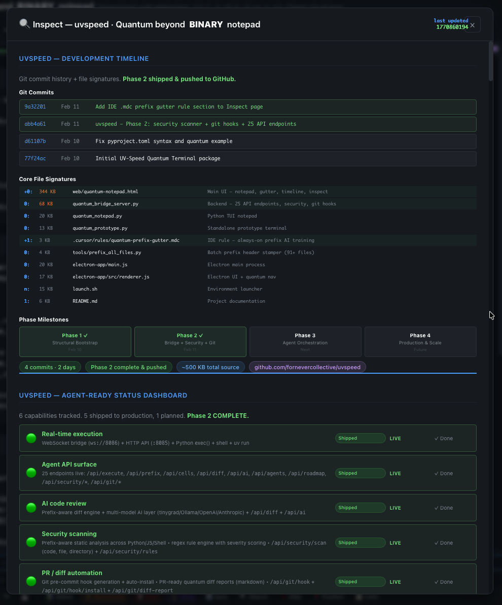
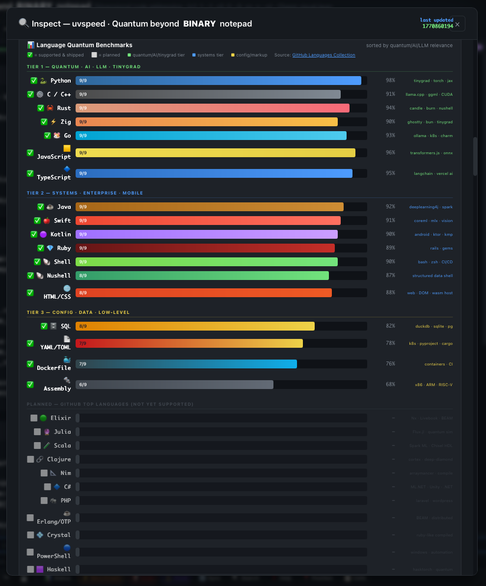
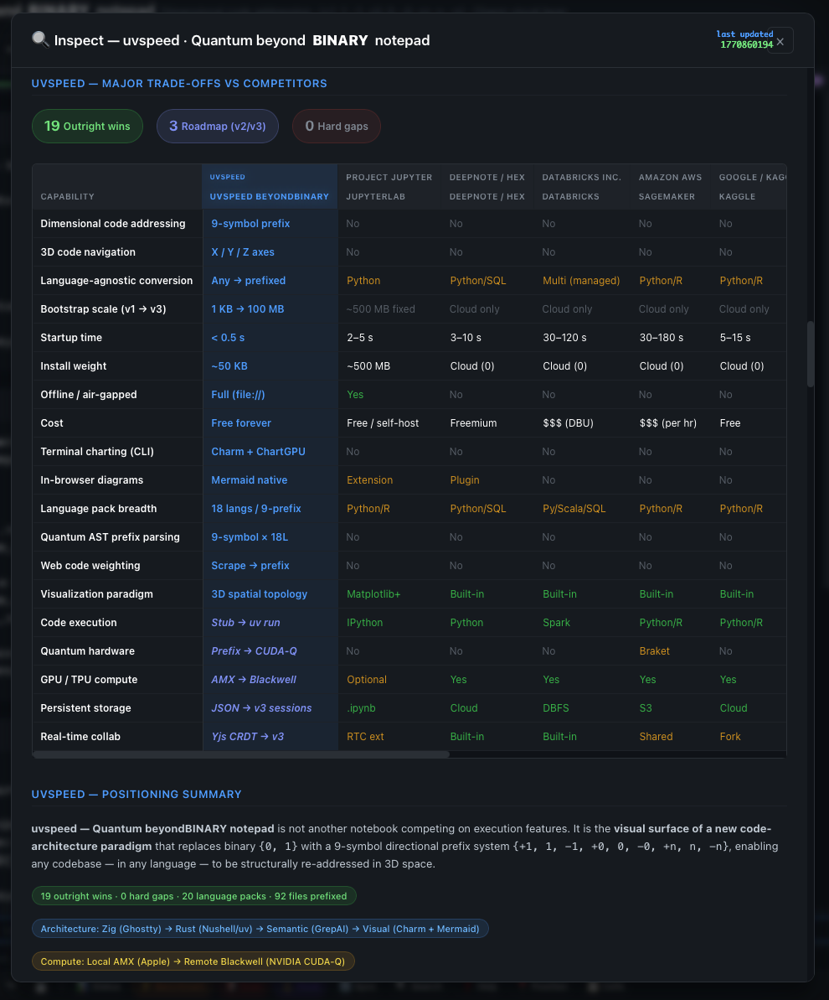
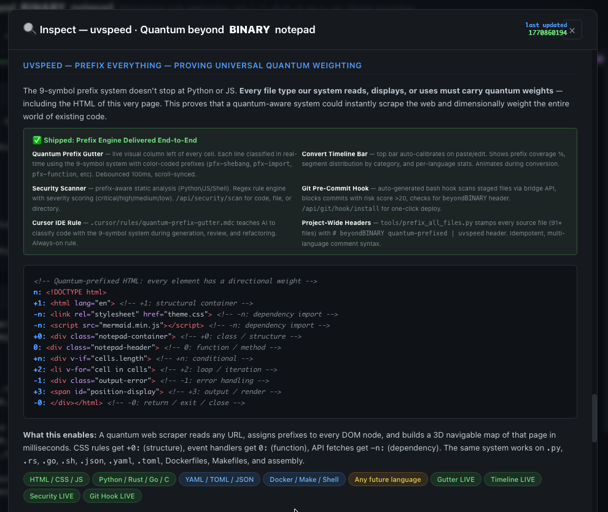
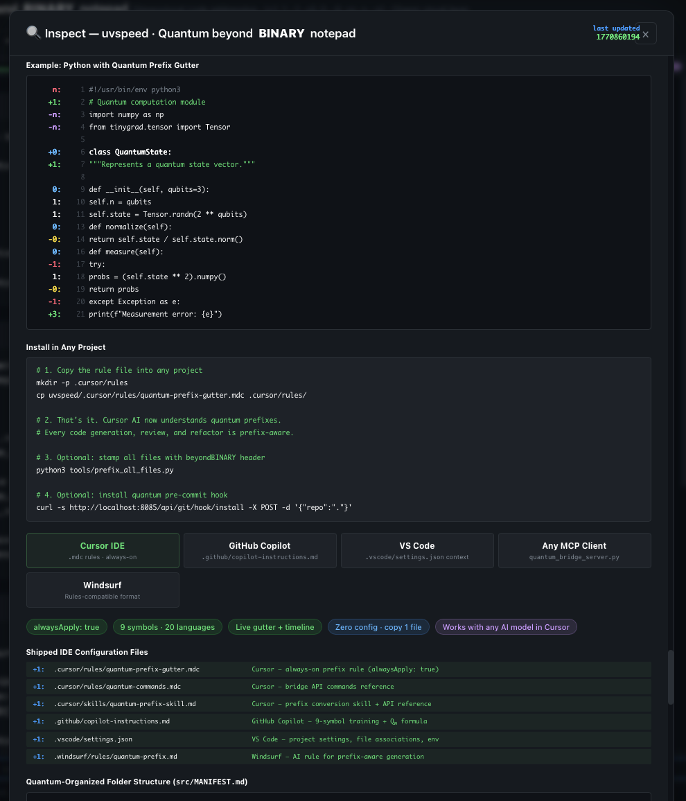
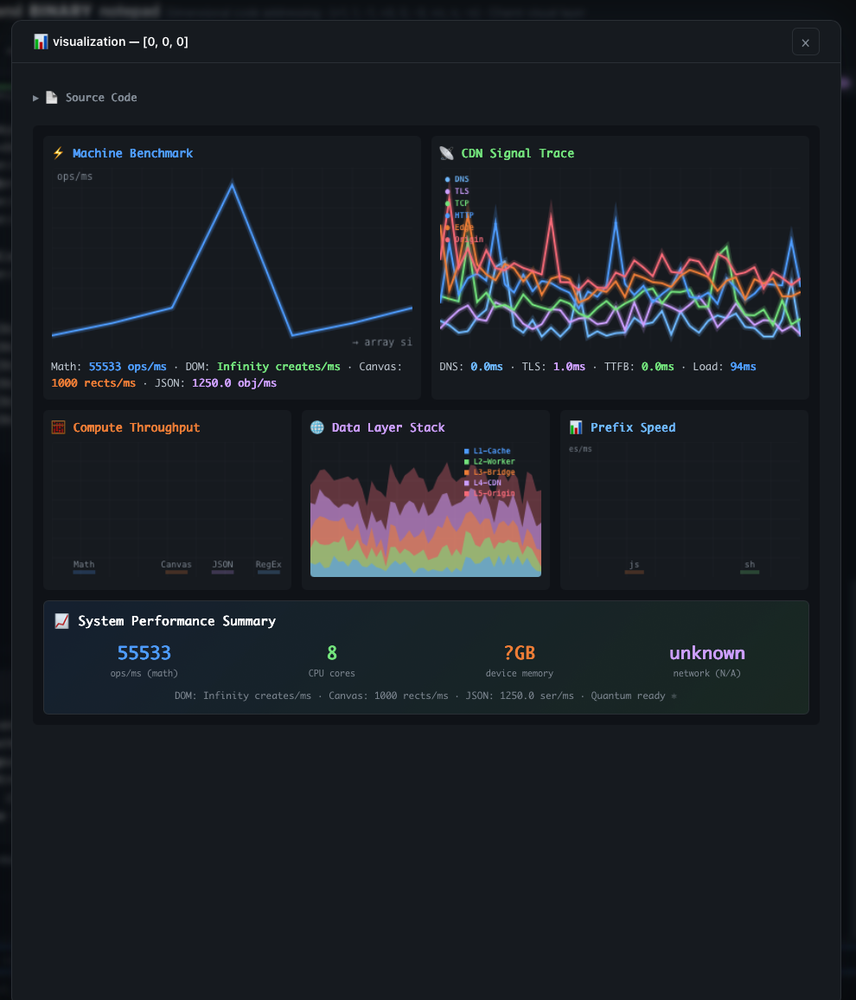
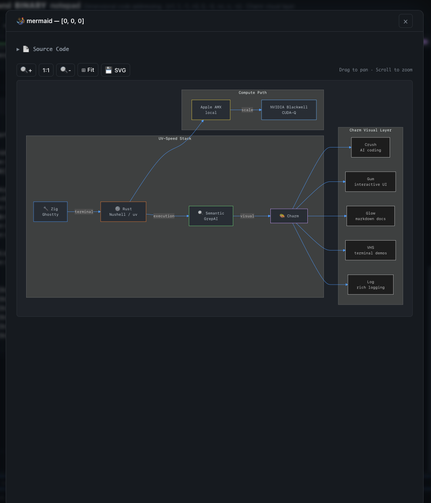
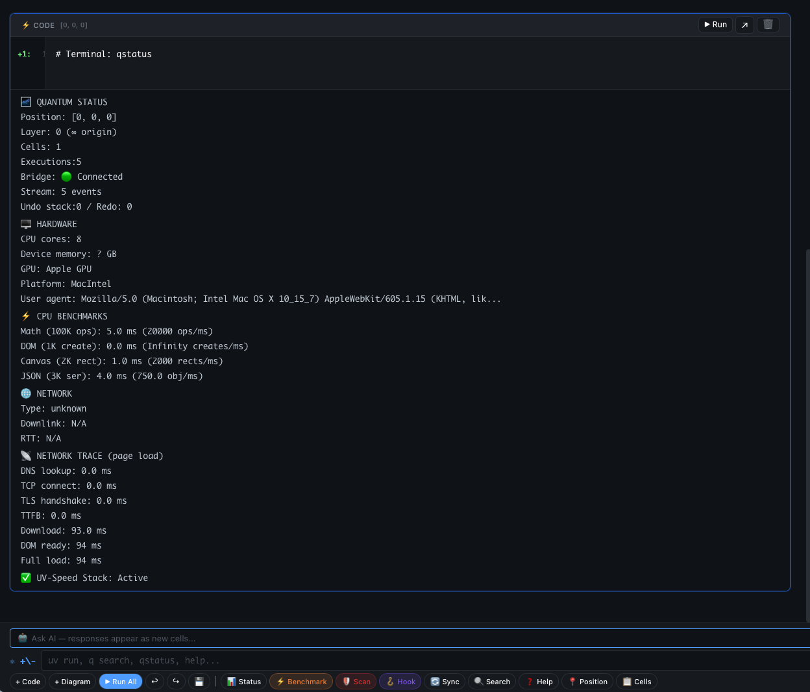
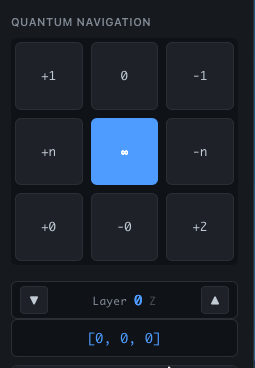

<!-- beyondBINARY quantum-prefixed | uvspeed | {+1, 1, -1, +0, 0, -0, +n, n, -n} -->

# uvspeed — Quantum beyondBINARY Notepad

> A new code architecture paradigm that replaces binary `{0, 1}` with a 9-symbol directional prefix system `{+1, 1, -1, +0, 0, -0, +n, n, -n}`, enabling any codebase — in any language — to be structurally re-addressed in 3D space.

[](#phase-tracking)
[](#language-benchmark-coverage)
[](#api-surface)
[](https://pypi.org/project/uvspeed-quantum/)
[](https://www.npmjs.com/package/uvspeed-quantum)
[](LICENSE)
[](https://fornevercollective.github.io/uvspeed/web/quantum-notepad.html)

**[Launch Live Demo](https://fornevercollective.github.io/uvspeed/web/quantum-notepad.html)** | [GitHub Repo](https://github.com/fornevercollective/uvspeed)

---

## Preview

<p align="center">

</p>

<p align="center"><em>Main interface — quantum prefix gutter, convert timeline bar, 3D navigation, stream history, and footer command bar</em></p>

---

## Phase Tracking

| Phase | Status | Milestone | Date |
|-------|--------|-----------|------|
| **Phase 1** | Complete | Structural Bootstrap — prefix system, notepad UI, navigation, mermaid | Feb 10 |
| **Phase 2** | Complete | Execution Bridge — 25 API endpoints, security scanner, git hooks, IDE rules | Feb 11 |
| **Phase 2.1** | Complete | Cross-Project Integration — ChartGPU, Day CLI, Quest Hub, Jawta, Lark, Media | Feb 11 |
| **Phase 2.2** | Complete | Release Infrastructure — GitHub Actions, PyPI, npm, CHANGELOG, `.gitattributes` | Feb 11 |
| **Phase 3** | Next | Agent Orchestration — multi-agent protocol, role-based prefix access | — |
| **Phase 4** | Future | Production & Scale — CUDA-Q offload, real-time collab, SaaS deploy | — |

### Agent-Ready Capabilities

| Capability | Status | Details |
|------------|--------|---------|
| Real-time execution | LIVE | WebSocket bridge (`ws://8086`) + HTTP API (`:8085`) + Python exec + shell + uv run |
| Agent API surface | LIVE | 40+ endpoints: execute, prefix, diff, AI, agents, sessions, security, git, tools |
| AI code review | LIVE | Prefix-aware diff engine + multi-model AI (tinygrad/Ollama/OpenAI/Anthropic) |
| Security scanning | LIVE | Prefix-aware static analysis (Python/JS/Shell), severity scoring |
| PR / diff automation | LIVE | Git pre-commit hook + PR-ready quantum diff reports |
| Cross-project tools | LIVE | ChartGPU, Day CLI (kbatch/signal/geokey/youtube), Quest Hub, Jawta, Lark, Media Pipeline |
| Multi-agent orchestration | Phase 3 | 5 agents registered — inter-agent protocol pending |

<details>
<summary><strong>View: Development Timeline + Agent Dashboard</strong></summary>



*Inspect page — git commit history, core file signatures, phase milestones, and live agent-ready status dashboard*

</details>

---

## Repo Language Stats

| Language | Repo % | Role |
|----------|--------|------|
| HTML | ~27% | Notepad UI, Electron shell |
| JavaScript | ~27% | Notebook engine, bridge client, P2P, service worker |
| CSS | ~19% | Quantum theme, gutter, timeline, inspect |
| Python | ~16% | Bridge server (40+ endpoints), prefix engine, tools |
| Shell | ~12% | Launch scripts, build scripts, deploy automation |

> **Note:** The prefix system *targets* 20 languages — the repo itself is built in 5. See coverage below.

---

## Language Benchmark Coverage

20 languages supported with quantum prefix classification, sorted by AI/LLM relevance:

<p align="center">

</p>

<details>
<summary><strong>Full benchmark table</strong></summary>

**Tier 1 — Quantum / AI / LLM / tinygrad**
| Language | Coverage | Prefixes | AI/ML Relevance |
|----------|----------|----------|-----------------|
| Python | 98% | 9/9 | tinygrad, torch, jax, micrograd |
| C / C++ | 91% | 9/9 | llama.cpp, ggml, CUDA, onnxruntime |
| Rust | 94% | 9/9 | candle, burn, nushell |
| Zig | 90% | 9/9 | ghostty, bun, tinygrad backend |
| Go | 93% | 9/9 | ollama, k8s, charm |
| JavaScript | 96% | 9/9 | transformers.js, onnx web |
| TypeScript | 95% | 9/9 | langchain, vercel ai sdk |

**Tier 2 — Systems / Enterprise**
| Language | Coverage | Prefixes | Domain |
|----------|----------|----------|--------|
| Java | 92% | 9/9 | deeplearning4j, spark ML |
| Swift | 91% | 9/9 | CoreML, MLX, Vision |
| Kotlin | 90% | 9/9 | Android, KMP |
| Ruby | 89% | 9/9 | Rails ecosystem |
| Shell | 90% | 9/9 | bash, zsh, CI/CD |
| Nushell | 87% | 8/9 | Structured data shell |
| HTML/CSS | 88% | 8/9 | Web, DOM, WASM host |

**Tier 3 — Config / Data**
| Language | Coverage | Prefixes | Domain |
|----------|----------|----------|--------|
| SQL | 82% | 8/9 | DuckDB, SQLite, Postgres |
| YAML/TOML | 78% | 7/9 | k8s, pyproject, Cargo |
| Dockerfile | 76% | 7/9 | Containers, CI |
| Assembly | 68% | 6/9 | x86, ARM, RISC-V |

</details>

---

## Competitor Comparison

<p align="center">

</p>

<p align="center"><em>19 outright wins vs Project Jupyter, Deepnote/Hex, Databricks, SageMaker, and Kaggle — 0 hard gaps</em></p>

---

## The beyondBINARY System

### Prefix Everything

The 9-symbol prefix system classifies every line of code in every language. Every file type our system reads, displays, or uses carries quantum weights.

<p align="center">

</p>

### Training Formula for LLMs & MCPs

A universal formula and training protocol for any LLM, MCP server, or AI agent to learn, adopt, and enhance the beyondBINARY paradigm:

```
Q_w(line) = P_prefix × D_depth × C_context × S_semantic
```

<p align="center">

</p>

### IDE Plugin: Cursor .mdc Rule

A Cursor IDE rule that teaches any AI model the beyondBINARY 9-symbol system natively. Zero config — copy one file.

<p align="center">

</p>

<details>
<summary><strong>View: IDE Install Instructions + Config Files</strong></summary>



*Supported IDEs: Cursor (.mdc rules + skills), GitHub Copilot, VS Code, Windsurf — plus quantum-organized folder structure*

</details>

### Example: Python with Prefixes

```python
# n:   1  #!/usr/bin/env python3
# +1:  2  # Quantum computation module
# -n:  3  import numpy as np
# -n:  4  from tinygrad.tensor import Tensor
#      5
# +0:  6  class QuantumState:
# +1:  7      """Represents a quantum state vector."""
#      8
# 0:   9      def __init__(self, qubits=3):
# 1:  10          self.n = qubits
# 1:  11          self.state = Tensor.randn(2 ** qubits)
#     12
# 0:  13      def normalize(self):
# -0: 14          return self.state / self.state.norm()
#     15
# 0:  16      def measure(self):
# -1: 17          try:
# 1:  18              probs = (self.state ** 2).numpy()
# -0: 19              return probs
# -1: 20          except Exception as e:
# +3: 21              print(f"Measurement error: {e}")
```

---

## Visualizations

### Machine Benchmark + CDN Signal Trace

<p align="center">

</p>

### Mermaid Architecture Diagram

Interactive mermaid diagrams with pan/zoom/drag, SVG export, and expand overlay:

<p align="center">

</p>

### Quantum Status + System Info

<p align="center">

</p>

### Quantum Navigation

3D code-space navigation with the 9-symbol grid. X = dependencies, Y = lines, Z = complexity.

<p align="center">

</p>

---

## Quick Start

### Live Demo (zero install)

```
https://fornevercollective.github.io/uvspeed/web/quantum-notepad.html
```

### Local (file open)
```bash
open web/quantum-notepad.html
```

### Bridge Server (40+ API endpoints)
```bash
uv run python quantum_bridge_server.py
# HTTP on :8085 · WebSocket on :8086
```

### Electron Desktop App
```bash
npm install && npm start
```

---

## API Surface (40+ endpoints)

### Core Endpoints (25)

| Method | Endpoint | Description |
|--------|----------|-------------|
| GET | `/api/status` | Server status + integration info |
| POST | `/api/execute` | Execute code (Python/shell/uv) |
| POST | `/api/prefix` | Convert code to quantum-prefixed |
| POST | `/api/prefix/file` | Prefix a file |
| GET | `/api/cells` | List notebook cells |
| POST | `/api/cells` | Create cell |
| POST | `/api/navigate` | Move through 3D code space |
| POST | `/api/diff` | Prefix-aware structural diff |
| POST | `/api/ai` | AI inference (tinygrad/Ollama/OpenAI/Anthropic) |
| GET | `/api/ai/models` | List AI models |
| GET/POST | `/api/agents` | Manage agents |
| POST | `/api/agents/send` | Send message to agent |
| GET/POST | `/api/sessions` | Save/load sessions |
| POST | `/api/roadmap/scan` | Scan codebase for conversion |
| POST | `/api/security/scan` | Security scan |
| GET/POST | `/api/git/hook` | Pre-commit hook management |
| POST | `/api/git/diff-report` | PR-ready quantum diff report |

### Cross-Project Integration (15+)

| Method | Endpoint | Description |
|--------|----------|-------------|
| GET | `/api/chartgpu/status` | ChartGPU server status |
| GET | `/api/chartgpu/metrics` | Live system metrics (CPU/MEM/GPU) |
| POST | `/api/chartgpu/analyze` | AI-powered trend analysis |
| POST | `/api/day/kbatch` | Keyboard pattern analysis |
| POST | `/api/day/signal` | Jawta signal analysis (Morse/binary/waveform) |
| POST | `/api/day/geokey` | Geometric keyboard mapping |
| POST | `/api/day/youtube` | YouTube transcript extraction |
| GET | `/api/tools/list` | List all registered tools |
| POST | `/api/tools/exec` | Execute any registered command |
| GET | `/api/quest/status` | Quest device + Hub status |
| GET | `/api/quest/device` | Quest device info via Hub |
| POST | `/api/quest/deploy` | Deploy APK to Quest |
| POST | `/api/jawta/signal` | Signal intel + spectrum analysis |
| GET | `/api/lark/status` | Lark IANA availability |
| POST | `/api/media/process` | Media pipeline orchestration |

---

## IDE Support

| IDE | Config File | Status |
|-----|-------------|--------|
| **Cursor** | `.cursor/rules/quantum-prefix-gutter.mdc` | Always-on rule |
| **Cursor** | `.cursor/rules/quantum-commands.mdc` | API commands |
| **Cursor** | `.cursor/skills/quantum-prefix-skill.md` | Conversion skill |
| **GitHub Copilot** | `.github/copilot-instructions.md` | Training instructions |
| **VS Code** | `.vscode/settings.json` | Project settings |
| **Windsurf** | `.windsurf/rules/quantum-prefix.md` | AI rule |

---

## Architecture

```
Zig (Ghostty) → Rust (Nushell/uv) → Semantic (GrepAI) → Visual (Charm + Mermaid)
```

| Layer | Technology | Purpose |
|-------|-----------|---------|
| Runtime | uv + Python 3.13 | Ultra-fast package management |
| Backend | quantum_bridge_server.py | 40+ endpoint HTTP + WebSocket server |
| Frontend | quantum-notepad.html | Single-file web app — notepad, gutter, timeline, inspect |
| Desktop | Electron | Native app with quantum navigation |
| AI | tinygrad / Ollama / OpenAI / Anthropic | Multi-model inference |
| Security | SecurityScanner | Prefix-aware static analysis |
| Git | GitHookEngine | Pre-commit hooks + PR diff reports |
| ChartGPU | WebGPU charts + AI analysis | GPU-accelerated metrics dashboard |
| Day CLI | kbatch, signal, geokey, youtube | Keyboard/signal/geo/transcript tools |
| Quest | synced-app Hub + ADB | VR device management + deployment |
| Jawta | Signal intel + spectrum | Morse/binary/audio waveform |
| Lark | IANA editor + terminal | Unified AI dev environment |
| Media | Pipeline orchestrator | Spatial audio, video segmentation, transcripts |

## Project Structure

```
uvspeed/
├── web/quantum-notepad.html      # +0: Main UI — notepad, gutter, timeline, thermal, inspect
├── quantum_bridge_server.py      #  0: Backend — 40+ API endpoints + cross-project integration
├── icons/                        # +1: Screenshots for README
│   ├── 01-notepad-main.png       #     Main interface
│   ├── 02-inspect-timeline.png   #     Dev timeline + agent dashboard
│   ├── 03-language-benchmarks.png#     20-language coverage chart
│   ├── 04-competitor-comparison.png#   vs Jupyter/Deepnote/Databricks
│   ├── 05-prefix-everything.png  #     Universal prefix engine
│   ├── 06-training-formula.png   #     Q_w formula for LLMs
│   ├── 07-ide-plugin-rule.png    #     Cursor .mdc rule
│   ├── 08-ide-install-configs.png#     Multi-IDE setup
│   ├── 09-visual-benchmark.png   #     Machine profiler charts
│   ├── 10-mermaid-architecture.png#    Architecture diagram
│   ├── 11-qstatus-output.png     #     System status output
│   └── 12-quantum-navigation.png #     3D navigation widget
├── src/commands.json             #  0: Unified tool registry (23 commands)
├── .cursor/rules/                # +1: IDE rules (prefix gutter, commands)
├── .cursor/skills/               # +1: IDE skills (prefix conversion)
├── .github/copilot-instructions.md  # +1: Copilot training
├── .windsurf/rules/              # +1: Windsurf AI rule
├── tools/prefix_all_files.py     #  0: Batch prefix stamper (91+ files)
├── electron-app/                 # +0: Desktop app (Electron)
├── src/                          #     Quantum-organized by prefix
└── versions/                     # +2: Progressive v1/v2/v3
```

---

## Shipped Features

### Phase 1 + 2
- **Quantum Prefix Gutter** — live visual column, 9-symbol classification, color-coded, debounced, scroll-synced
- **Convert Timeline Bar** — auto-calibrates on paste/edit, shows coverage %, segment distribution
- **Quantum Navigation** — 3D code space [X, Y, Z] with layer up/down, versioned grid
- **Mermaid Diagrams** — render, expand overlay, pan/zoom/drag, SVG export
- **Visual Benchmarks** — 5-chart machine profiler (Math, DOM, Canvas, JSON, CDN)
- **Security Scanner** — prefix-aware static analysis with severity scoring
- **Git Pre-Commit Hook** — auto-generated, blocks high-risk commits
- **PR Diff Reports** — markdown reports with prefix-category breakdown
- **Undo/Redo** — 50-state history with keyboard shortcuts
- **Stream History** — quantum trace log with pipe in/out
- **Execution Progress Bar** — percentage fill with elapsed time
- **6 IDE Configs** — Cursor, Copilot, VS Code, Windsurf
- **91+ files prefixed** — every source file carries the beyondBINARY header

### Phase 2.1 — Cross-Project Integration
- **ChartGPU** — WebGPU-accelerated charts, AI trend analysis, metrics proxy
- **Quantum Thermal Visualization** — lattice/flow/GPU-vs-qubit canvas, temperature states, Xanadu photonic
- **HF Fax / Hex Stream** — color/grayscale/fax viewer, 1080x1080 overlay, live animation
- **Day CLI Tools** — kbatch keyboard analysis, signal intel, geokey mapper, YouTube transcripts
- **Quest Device Integration** — Hub proxy, ADB devices, deploy, logs, screenshots
- **Jawta Signal Intel** — Morse, binary, spectrum analysis, audio waveform
- **Lark IANA** — editor/terminal/AI-chat status and embed
- **Media Pipeline** — spatial audio, video segmentation, transcript orchestration
- **Tools Dropdown** — 14-tool command palette in footer, plus command-bar shortcuts
- **Unified Commands Registry** — 23 commands across 5 tool groups

---

## Releases & Packages

### GitHub Releases

Tagged releases auto-build via [GitHub Actions](.github/workflows/release.yml).
To cut a release:

```bash
git tag v2.1.0
git push origin v2.1.0
```

Each release includes:
- `uvspeed-{version}.tar.gz` — full archive (no `node_modules`)
- `uvspeed_quantum-{version}.whl` — Python wheel
- `uvspeed-quantum-{version}.tar.gz` — Python sdist
- Auto-generated release notes from commits

### PyPI (Python)

```bash
pip install uvspeed-quantum           # core (websockets)
pip install uvspeed-quantum[full]     # + psutil, numpy, aiohttp
```

Once installed, run the bridge server:
```bash
uvspeed-bridge                        # starts HTTP :8085 + WS :8086
```

### npm (Node / Electron)

```bash
npm install uvspeed-quantum
npm start                             # launches Electron desktop app
```

### GitHub Pages (Live Demo)

Auto-deploys on push to `main` via [Pages workflow](.github/workflows/pages.yml):
```
https://fornevercollective.github.io/uvspeed/web/quantum-notepad.html
```

### Roadmap to Official Packages

| Package | Registry | Status | Next Step |
|---------|----------|--------|-----------|
| `uvspeed-quantum` | PyPI | Ready | `twine upload` (add `PYPI_TOKEN` secret) |
| `uvspeed-quantum` | npm | Ready | `npm publish` (add npm auth) |
| `uvspeed-quantum-terminal` | Electron (dmg/AppImage/nsis) | Config ready | `npm run build-mac` / `build-linux` / `build-win` |
| Cursor Extension | VS Code Marketplace | `.mdc` rule shipped | Package as `.vsix` extension |
| Homebrew tap | Homebrew | Planned | Create `homebrew-uvspeed` formula |
| Docker image | Docker Hub / GHCR | Planned | Write `Dockerfile` with uv + bridge |

---

## License

MIT — see [LICENSE](LICENSE)

---

<p align="center">
<code>{+1, 1, -1, +0, 0, -0, +n, n, -n}</code><br>
<strong>beyondBINARY</strong> — quantum-prefixed code architecture<br>
<a href="https://fornevercollective.github.io/uvspeed/web/quantum-notepad.html">Live Demo</a> ·
<a href="https://github.com/fornevercollective/uvspeed">GitHub</a>
</p>
