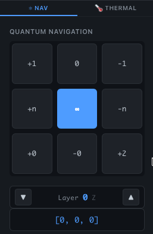
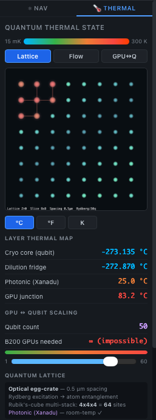
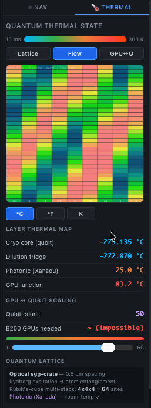
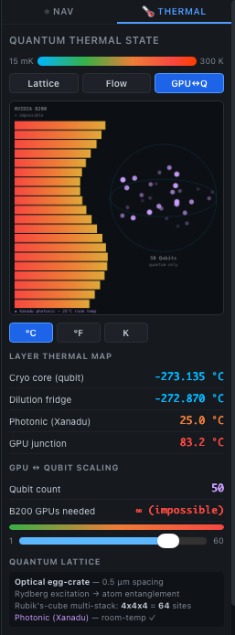

<!-- beyondBINARY quantum-prefixed | uvspeed | {+1, 1, -1, +0, 0, -0, +n, n, -n} -->

<p align="center">

</p>

> A new code architecture paradigm that replaces binary `{0, 1}` with a 9-symbol directional prefix system `{+1, 1, -1, +0, 0, -0, +n, n, -n}`, enabling any codebase — in any language — to be structurally re-addressed in 3D space.

[](#phase-tracking)
[](#language-benchmark-coverage)
[](#api-surface)
[](#mcp-server--cursor-integration)
[](https://pypi.org/project/uvspeed-quantum/)
[](https://www.npmjs.com/package/uvspeed-quantum)
[](LICENSE)
[](https://fornevercollective.github.io/uvspeed/web/quantum-notepad.html)

**[Launch Live Demo](https://fornevercollective.github.io/uvspeed/web/quantum-notepad.html)** | **[Play brotherNumsy & Freya](https://fornevercollective.github.io/uvspeed/web/brothernumsy.html)** | **[kbatch Analyzer](https://fornevercollective.github.io/uvspeed/web/kbatch.html)** | **[hexcast Broadcast](https://fornevercollective.github.io/uvspeed/web/hexcast.html)** | **[Blackwell Live](https://fornevercollective.github.io/uvspeed/web/blackwell.html)** | **[questcast](https://fornevercollective.github.io/uvspeed/web/questcast.html)** | **[archflow](https://fornevercollective.github.io/uvspeed/web/archflow.html)** | **[jawta audio](https://fornevercollective.github.io/uvspeed/web/jawta-audio.html)** | [GitHub Repo](https://github.com/fornevercollective/uvspeed)

---

## Preview

<p align="center">

</p>

<p align="center"><em>Main interface — quantum prefix gutter, convert timeline bar, 3D navigation, stream history, and footer command bar</em></p>

---

## Phase Tracking

| Phase | Status | Milestone | Date |
|-------|--------|-----------|------|
| **Phase 1** | Complete | Structural Bootstrap — prefix system, notepad UI, navigation, mermaid | Feb 10 |
| **Phase 2** | Complete | Execution Bridge — 25 API endpoints, security scanner, git hooks, IDE rules | Feb 11 |
| **Phase 2.1** | Complete | Cross-Project Integration — ChartGPU, Day CLI, Quest Hub, Jawta, Lark, Media | Feb 11 |
| **Phase 2.2** | Complete | Release + Game — GitHub Actions, PyPI, brotherNumsy & Freya, FreyaUnits converter | Feb 11 |
| **Phase 2.3** | Complete | Interactive Tools — kbatch keyboard analyzer, hexcast video broadcast, notepad cells | Feb 11 |
| **Phase 3.0** | Complete | Project Restructure — numbered `src/` layout, Electron update, clean root, Phase 3 cross-check | Feb 12 |
| **Phase 3.1** | Complete | Blackwell Live — NVIDIA data viz page, SM heatmap, deploy targets (DGX Spark/Supermicro/Lambda), quantum nav sidebar, logo update | Feb 12 |
| **Phase 3.2** | Complete | Dev Pages — questcast (Meta Research broadcast), archflow (n8n node visualizer), jawta-audio (Dolby Atmos + Strudel live code) | Feb 12 |
| **Phase 3.3** | Complete | Multi-Instance Architecture — QubesOS-style Electron windows, MCP server (10 tools), session/instance manager, dynamic Ollama model picker, tinygrad prefix classifier | Feb 12 |
| **Phase 3.4** | Next | Agent Orchestration — multi-agent protocol, role-based prefix access, self-training, fine-tuned prefix model | — |
| **Phase 4** | Future | Terminal/OS App — prefix engine + live streaming + kbatch + FreyaUnits + thermal visuals, unified from the ground up | — |

### Agent-Ready Capabilities

| Capability | Status | Details |
|------------|--------|---------|
| Real-time execution | LIVE | WebSocket bridge (`ws://8086`) + HTTP API (`:8085`) + Python exec + shell + uv run |
| Agent API surface | LIVE | 40+ endpoints: execute, prefix, diff, AI, agents, sessions, security, git, tools |
| AI code review | LIVE | Prefix-aware diff engine + multi-model AI (tinygrad/Ollama/OpenAI/Anthropic) |
| Security scanning | LIVE | Prefix-aware static analysis (Python/JS/Shell), severity scoring |
| PR / diff automation | LIVE | Git pre-commit hook + PR-ready quantum diff reports |
| Cross-project tools | LIVE | ChartGPU, Day CLI (kbatch/signal/geokey/youtube), Quest Hub, Jawta, Lark, Media Pipeline |
| brotherNumsy & Freya | LIVE | Side-scroller game, pixel-art sprites, FreyaUnits 27-unit engine, AI training API |
| kbatch analyzer | LIVE | Thermal heatmap, contrails, geometric patterns, 3D language model, `window.kbatch` |
| hexcast broadcast | LIVE | Video → hex stream, 4 encode modes, latency benchmarks, BroadcastChannel cross-tab |
| FreyaUnits converter | LIVE | Planck→Parsec 27-unit precision system, notebook cell + game companion |
| Blackwell Live | LIVE | NVIDIA Blackwell data viz — SM heatmap, stream canvas, deploy targets (DGX Spark/Supermicro/Lambda/Colab) |
| questcast | LIVE | Meta Quest broadcast — Detectron2, BabyTrack, SAM2/3, DINOv3, Momentum, 4-panel tracking/segmentation/depth |
| archflow | LIVE | n8n-style architecture visualizer — draggable nodes, connections, mermaid diagram editor, preset layouts |
| jawta audio | LIVE | Spatial audio — Dolby Atmos 7.1.4, binaural HRTF, 8-band EQ, Strudel live code, waveform/spectrum analysis |
| Project structure | LIVE | Numbered `src/01-07`, clean root, Electron 40.4, version 3.2.0 |
| Multi-instance (QubesOS) | LIVE | Isolated Electron windows per page, window registry, IPC cross-window messaging, layout save/restore |
| MCP server | LIVE | 10 MCP tools (prefix, execute, navigate, diff, AI, sessions, etc.) — stdio transport for Cursor/Claude Desktop |
| Instance manager | LIVE | Register/unregister instances, cross-instance messaging, state get/set, heartbeat, layout export |
| Ollama model picker | LIVE | Dynamic model discovery via `/api/tags`, runtime model switching, env-configurable default (`OLLAMA_MODEL`) |
| tinygrad prefix classifier | LIVE | 15-feature vector extraction, weight matrix inference (tinygrad/numpy), per-line confidence scores |
| Multi-agent orchestration | Phase 3.4 | 5 agents registered — inter-agent protocol pending |

<details>
<summary><strong>View: Development Timeline + Agent Dashboard</strong></summary>


*Inspect page — git commit history, core file signatures, phase milestones, and live agent-ready status dashboard*

</details>

---

## Repo Language Stats

| Language | Repo % | Role |
|----------|--------|------|
| HTML | ~27% | Notepad UI, Electron shell |
| JavaScript | ~27% | Notebook engine, bridge client, P2P, service worker |
| CSS | ~19% | Quantum theme, gutter, timeline, inspect |
| Python | ~16% | Bridge server (40+ endpoints), prefix engine, tools |
| Shell | ~12% | Launch scripts, build scripts, deploy automation |

> **Note:** The prefix system *targets* 20 languages — the repo itself is built in 5. See coverage below.

---

## Data Architecture Stack

```
Zig (Ghostty) → Rust (Nushell/uv) → Semantic (GrepAI) → Visual (Charm + Mermaid)
```

| Layer | Technology | Purpose |
|-------|-----------|---------|
| **Terminal** | Zig → Ghostty | GPU-accelerated terminal renderer |
| **Runtime** | Rust → Nushell + uv | Structured shell + ultra-fast Python packaging |
| **Semantic** | GrepAI + AST | Quantum prefix classification + code intelligence |
| **Visual** | Charm + Mermaid | TUI components + interactive architecture diagrams |
| **Bridge** | Python 3.13 + WebSocket | 55+ endpoint HTTP `:8085` + WS `:8086` server |
| **MCP** | mcp_server.py (stdio) | 10 MCP tools for Cursor/Claude Desktop integration |
| **Frontend** | Single-file HTML + JS | Zero-dependency web apps served via GitHub Pages |
| **Desktop** | Electron 40.4 | Multi-instance windows (QubesOS-style) + IPC bridge |
| **GPU Viz** | Canvas + WebGPU | SM heatmaps, thermal canvas, data stream graphs |
| **AI** | tinygrad / Ollama / OpenAI / Anthropic | Prefix classifier + dynamic model picker + cloud fallback |

### Suggested Install

```bash
# 1. Runtime — uv (replaces pip/venv/pyenv in one binary)
curl -LsSf https://astral.sh/uv/install.sh | sh

# 2. Shell — Nushell (structured data shell, Rust-based)
cargo install nu                       # or: brew install nushell

# 3. Terminal — Ghostty (GPU-accelerated, Zig-based)
brew install ghostty                   # macOS — or build from source

# 4. Bridge server (55+ endpoints)
uv run python src/01-core/quantum_bridge_server.py

# 5. MCP server (Cursor / Claude Desktop integration)
#    Add to .cursor/mcp.json:
#    {"mcpServers":{"uvspeed":{"command":"python","args":["src/01-core/mcp_server.py"]}}}
python src/01-core/mcp_server.py

# 6. Desktop app (multi-instance)
npm install && npm start

# 7. Web (zero install)
open web/quantum-notepad.html
```

---

## Folder Structure (v3.3)

| Folder | Contents | Files | Size | Phase |
|--------|----------|-------|------|-------|
| `src/01-core/` | Python backend — bridge server (55+ endpoints), MCP server (10 tools), notepad engine, prototype runtime | 7 | 268 KB | Phase 1–3.3 |
| `src/02-electron/` | Desktop app — Electron 40.4, multi-instance windows, preload IPC, quantum menus, renderer | 5 | 168 KB | Phase 2–3.3 |
| `src/03-tools/` | 16 launch/build scripts — platform launchers, prefix tool, multi-platform builds | 16 | 144 KB | Phase 2–3 |
| `src/04-tests/` | 12 test files consolidated — bridge, prefix, navigation, security, integration | 12 | 324 KB | Phase 2 |
| `src/05-examples/` | Hello quantum example project — pyproject.toml, uv.lock, demo script | 4 | 252 KB | Phase 2 |
| `src/06-extensions/` | Browser extensions — Chrome manifest, Firefox, PWA service worker, quantum theme CSS, content scripts | 39 | 664 KB | Phase 2.1 |
| `src/07-archive/` | Historical versions v1-core / v2-terminal / v3-complete, old configs, shared tools | 58 | 628 KB | Phase 1–3 |
| `web/` | Web tools — notepad, brotherNumsy, kbatch, hexcast, Blackwell, questcast, archflow, jawta-audio, legacy | 14 | 1.1 MB | Phase 1–3.2 |
| `icons/` | 23 numbered screenshots + favicon + nyan-banner + icon-192 | 27 | 3.7 MB | Phase 1–3 |
| `.cursor/rules/` | IDE rules — quantum-prefix-gutter.mdc, quantum-commands.mdc | 2 | 12 KB | Phase 2 |
| `.github/workflows/` | CI/CD — Pages auto-deploy, tagged release builder | 2 | 12 KB | Phase 3 |

**Total source** (excl. `node_modules`): **~7.3 MB** across **179 files** | **Repo version**: 3.0.0 → 3.3.0

```
uvspeed/
├── src/
│   ├── 01-core/           268 KB   Phase 1–3.3  Bridge server + MCP server + notepad + prototype
│   ├── 02-electron/       168 KB   Phase 2–3.3  Electron multi-instance desktop app
│   ├── 03-tools/          144 KB   Phase 2–3    16 launch/build scripts
│   ├── 04-tests/          324 KB   Phase 2      12 consolidated test files
│   ├── 05-examples/       252 KB   Phase 2      Hello quantum demo
│   ├── 06-extensions/     664 KB   Phase 2.1    Chrome/Firefox/PWA extensions
│   └── 07-archive/        628 KB   Phase 1–3    v1/v2/v3 historical versions
├── web/                   1.1 MB   Phase 1–3.2  9 web apps + legacy
├── icons/                 3.7 MB   Phase 1–3    23 screenshots + assets
├── .cursor/rules/          12 KB   Phase 2      IDE quantum rules
├── .github/workflows/      12 KB   Phase 3      CI/CD pipelines
├── package.json                    Phase 2      npm: Electron 40.4, express, ws, xterm
├── pyproject.toml                  Phase 3      PyPI: uvspeed-quantum 3.0.0
├── uvspeed_cli.py                  Phase 3      CLI entry point
├── README.md                       Phase 1–3.1  This file
├── CHANGELOG.md                    Phase 3      Release history
└── LICENSE                         Phase 1      MIT
```

---

## Language Benchmark Coverage

20 languages supported with quantum prefix classification, sorted by AI/LLM relevance:

<p align="center">

</p>

<details>
<summary><strong>Full benchmark table</strong></summary>

**Tier 1 — Quantum / AI / LLM / tinygrad**
| Language | Coverage | Prefixes | AI/ML Relevance |
|----------|----------|----------|-----------------|
| Python | 98% | 9/9 | tinygrad, torch, jax, micrograd |
| C / C++ | 91% | 9/9 | llama.cpp, ggml, CUDA, onnxruntime |
| Rust | 94% | 9/9 | candle, burn, nushell |
| Zig | 90% | 9/9 | ghostty, bun, tinygrad backend |
| Go | 93% | 9/9 | ollama, k8s, charm |
| JavaScript | 96% | 9/9 | transformers.js, onnx web |
| TypeScript | 95% | 9/9 | langchain, vercel ai sdk |

**Tier 2 — Systems / Enterprise**
| Language | Coverage | Prefixes | Domain |
|----------|----------|----------|--------|
| Java | 92% | 9/9 | deeplearning4j, spark ML |
| Swift | 91% | 9/9 | CoreML, MLX, Vision |
| Kotlin | 90% | 9/9 | Android, KMP |
| Ruby | 89% | 9/9 | Rails ecosystem |
| Shell | 90% | 9/9 | bash, zsh, CI/CD |
| Nushell | 87% | 8/9 | Structured data shell |
| HTML/CSS | 88% | 8/9 | Web, DOM, WASM host |

**Tier 3 — Config / Data**
| Language | Coverage | Prefixes | Domain |
|----------|----------|----------|--------|
| SQL | 82% | 8/9 | DuckDB, SQLite, Postgres |
| YAML/TOML | 78% | 7/9 | k8s, pyproject, Cargo |
| Dockerfile | 76% | 7/9 | Containers, CI |
| Assembly | 68% | 6/9 | x86, ARM, RISC-V |

</details>

---

## Competitor Comparison

<p align="center">

</p>

<p align="center"><em>19 outright wins vs Project Jupyter, Deepnote/Hex, Databricks, SageMaker, and Kaggle — 0 hard gaps</em></p>

---

## The beyondBINARY System

### Prefix Everything

The 9-symbol prefix system classifies every line of code in every language. Every file type our system reads, displays, or uses carries quantum weights.

<p align="center">

</p>

### Training Formula for LLMs & MCPs

A universal formula and training protocol for any LLM, MCP server, or AI agent to learn, adopt, and enhance the beyondBINARY paradigm:

```
Q_w(line) = P_prefix × D_depth × C_context × S_semantic
```

<p align="center">

</p>

### IDE Plugin: Cursor .mdc Rule

A Cursor IDE rule that teaches any AI model the beyondBINARY 9-symbol system natively. Zero config — copy one file.

<p align="center">

</p>

<details>
<summary><strong>View: IDE Install Instructions + Config Files</strong></summary>


*Supported IDEs: Cursor (.mdc rules + skills), GitHub Copilot, VS Code, Windsurf — plus quantum-organized folder structure*

</details>

### Example: Python with Prefixes

```python
# n:   1  #!/usr/bin/env python3
# +1:  2  # Quantum computation module
# -n:  3  import numpy as np
# -n:  4  from tinygrad.tensor import Tensor
#      5
# +0:  6  class QuantumState:
# +1:  7      """Represents a quantum state vector."""
#      8
# 0:   9      def __init__(self, qubits=3):
# 1:  10          self.n = qubits
# 1:  11          self.state = Tensor.randn(2 ** qubits)
#     12
# 0:  13      def normalize(self):
# -0: 14          return self.state / self.state.norm()
#     15
# 0:  16      def measure(self):
# -1: 17          try:
# 1:  18              probs = (self.state ** 2).numpy()
# -0: 19              return probs
# -1: 20          except Exception as e:
# +3: 21              print(f"Measurement error: {e}")
```

---

## Visualizations

### Machine Benchmark + CDN Signal Trace

<p align="center">

</p>

### Mermaid Architecture Diagram

Interactive mermaid diagrams with pan/zoom/drag, SVG export, and expand overlay:

<p align="center">

</p>

### Quantum Status + System Info

<p align="center">

</p>

### Quantum Navigation + Thermal Panels

3D code-space navigation with the 9-symbol grid. X = dependencies, Y = lines, Z = complexity. Thermal panel shows quantum lattice (Lattice/Flow/GPU↔Q) with temperature map and Nyan Cat hex stream.

<p align="center">





</p>

---

## brotherNumsy & Freya — beyondBINARY Runner

An endless side-scrolling runner built entirely in one self-contained HTML file. Play as **brotherNumsy** — a robed, golden-aura figure inspired by Sardo Numspa from *The Golden Child* — dodging binary agents (`0` and `1`) while collecting quantum prefix symbols. Your companion **Freya** flies alongside you, measuring every meter of your journey using the **FreyaUnits** precision conversion engine (Planck length to Parsec).

**[Play Now](https://fornevercollective.github.io/uvspeed/web/brothernumsy.html)** | Also launchable from the notepad footer (`🎮 brotherNumsy & Freya` button) | Also runs as a notepad cell

<p align="center">

</p>

| Feature | Details |
|---------|---------|
| **brotherNumsy** | 16x16 pixel-art sprite with 4 animation frames (run1, run2, jump, duck) |
| **Freya** | 12x12 companion sprite (fly1, fly2, beam) — purple/cyan quantum palette, floats alongside the player |
| **FreyaUnits Engine** | Real 27-unit conversion system (ℓp → pc), live HUD showing distance in rotating units |
| **FreyaUnit Tokens** | Purple crystal collectibles (+15 pts) — collect 3 to trigger Freya's *conversion beam* |
| **Conversion Beam** | 2-second purple/cyan energy wave that clears all obstacles ahead |
| **Obstacles** | Ground binary `0`/`1` blocks (jump), flying `{0,1}` pairs (duck) |
| **Collectibles** | Quantum prefix symbols `{+1, -1, +0, 0, -0, +n, n, -n}` (+9 pts each) |
| **Golden Child** | Rare token — 3s invincibility + golden trail |
| **Scale Milestones** | Freya announces real-world facts as you pass 1mm, 1cm, 1in, 1ft, 1m, 1km, 1mi... |
| **Scoring** | Distance + collectibles, displayed as `+n: 1,337` |
| **Controls** | `Space`/`↑` jump, `↓` duck, touch on mobile |
| **AI Training** | `window.numsyAI` API — full game state including Freya power/beam/tokens |
| **FreyaUnits API** | `window.FreyaUnits` — convert between any 27 units from browser console |
| **Persistence** | High scores saved in localStorage |

### AI Training API

```javascript
// Game control
window.numsyAI.getState()  // {alive, score, speed, freyaPower, freyaBeamActive, distanceMeters, ...}
window.numsyAI.act('jump') // 'jump', 'duck', or 'none'
window.numsyAI.reset()     // restart the game
window.numsyAI.onFrame(cb) // register per-frame callback for RL training loops
```

### FreyaUnits Precision Converter (Notebook Cell)

<p align="center">

</p>

<p align="center"><em>Full 27-unit precision converter running as a notepad cell — logarithmic scale visualization, conversion table, quantum & wave properties</em></p>

### FreyaUnits Conversion API

```javascript
// Unit conversion from browser console
window.FreyaUnits.convert(1, 'mi', 'km')      // 1.60934
window.FreyaUnits.convert(1, 'AU', 'ly')       // 1.581e-5
window.FreyaUnits.toMeters(100, 'nm')           // 1e-7
window.FreyaUnits.fromMeters(0.0254, 'mil')     // 1000
window.FreyaUnits.bestUnit(42195)               // {sym:'km', name:'Kilometer', m:1000}
window.FreyaUnits.listUnits()                   // all 27 units with meter values
```

---

## kbatch — Keyboard Pattern Analyzer

A real-time keyboard analysis tool with thermal heatmaps, finger contrails, geometric pattern mapping, and 3D language modeling — all in one self-contained HTML file.

**[Launch kbatch](https://fornevercollective.github.io/uvspeed/web/kbatch.html)** | Also accessible from the notepad footer (`⌨ kbatch` button) | Also runs as a notepad cell

<p align="center">

</p>

| Feature | Details |
|---|---|
| 🔥 Thermal Heatmap | Live keyboard heat visualization — cold blue → green → yellow → red → white |
| ✈ Contrails | Finger movement path tracking with fading trails and glow markers |
| ⬡ Geometric Pattern | Radial key frequency mapping — keys orbit based on usage intensity |
| 🎹 3D Language Model | Word cloud with efficiency coloring, frequency badges, and analysis bars |
| 📊 Stats Bar | WPM, efficiency, complexity, strain, key count, distance, hapax legomena |
| ⌨ Real-time Analysis | All visualizations update live as you type |
| ⚡ Code Cell | Scriptable JS environment — `kbatch.analyze()`, `kbatch.processText()` |
| ☢ Terminal | Built-in CLI — `analyze`, `heatmap`, `contrails`, `efficiency`, `export` |
| ⛶ Fullscreen | Immersive analysis mode with native browser fullscreen |

### kbatch API

```javascript
window.kbatch.state           // {wpm, efficiency, complexity, strain, totalKeys, hapax, ...}
window.kbatch.analyze('word') // {efficiency, complexity, distance, path, length}
window.kbatch.processText(t)  // feed text for batch analysis
window.kbatch.topKeys(5)      // [{key, count}, ...] most-used keys
window.kbatch.heatmap()       // {key: count} raw heatmap
window.kbatch.transitions()   // [{from, to, dx, dy, dist}] movement data
window.kbatch.wordFreq()      // {word: count} frequency map
window.kbatch.exportJSON()    // full state as JSON string
```

---

## hexcast — Live Video Hex Broadcast

Real-time video capture → hex stream encoding → cross-device broadcast with full latency benchmarking. Streams camera, screen, or test patterns through the same thermal/fax hex grid used in the notepad — measuring encode, decode, round-trip, and jitter on every frame.

**[Launch hexcast](https://fornevercollective.github.io/uvspeed/web/hexcast.html)** | Also accessible from the notepad footer (`📡 hexcast` button) | Also runs as a notepad cell

<p align="center">

</p>

| Feature | Details |
|---|---|
| 📷 Camera Capture | Live webcam feed → hex stream encoding at configurable resolution |
| 🖵 Screen Capture | Screen share → hex stream for remote display testing |
| ▦ Test Pattern | Synthetic SMPTE-style color bars with moving scan line |
| 🔥 Encode Modes | Color Thermal, Grayscale, Fax B/W, Signal (green phosphor) |
| 📊 Latency Chart | Real-time line graph: encode (orange), decode (purple), round-trip (green), jitter (yellow) |
| 📡 BroadcastChannel | Cross-tab broadcast — one tab sends, another receives |
| ⏱ Benchmark | Automated encode/decode speed test across all resolutions × modes |
| 📸 Snapshot | Export current hex frame as PNG |
| ⚡ Code Cell | Full JS scripting — `hexcast.startCamera()`, `hexcast.benchmark()` |
| ☢ Terminal | CLI commands — `camera`, `screen`, `bench`, `latency`, `export` |

### hexcast API

```javascript
window.hexcast.state              // {source, fps, latency, throughput, frameSize, ...}
window.hexcast.startCamera()      // open webcam → hex stream
window.hexcast.startScreen()      // screen share → hex stream
window.hexcast.startTestPattern() // synthetic color bars
window.hexcast.stopSource()       // stop capture
window.hexcast.startBroadcast()   // send frames via BroadcastChannel
window.hexcast.startReceive()     // receive frames from another tab
window.hexcast.benchmark()        // [{resolution, mode, encodeMs, throughputMB}, ...]
window.hexcast.snapshot()         // save hex frame as PNG
window.hexcast.setEncode('fax')   // switch encode mode
window.hexcast.setResolution(108) // set grid resolution
window.hexcast.setFPS(30)         // set target framerate
window.hexcast.exportJSON()       // full state + latency history
```

---

## Blackwell Live — NVIDIA Data Visualization

Real-time visualization of NVIDIA Blackwell Ultra architecture — live SM heatmaps, data stream graphs, memory bandwidth monitoring, and server stack deploy targets for localized GPU infrastructure.

**[Launch Blackwell Live](https://fornevercollective.github.io/uvspeed/web/blackwell.html)** | Also accessible from the notepad footer (`🟢 Blackwell` button)

| Feature | Details |
|---------|---------|
| **SM Heatmap** | 192 streaming multiprocessor cells with live utilization coloring (idle → saturated) |
| **Stream Canvas** | Real-time line graph: SM throughput, HBM3e bandwidth, NVLink traffic, power draw, temperature |
| **Attention Layer** | Transformer Engine 2.0 visualization — FP4/FP6/FP8 precision acceleration |
| **Specs Comparison** | Blackwell Ultra vs Blackwell vs Hopper — transistors, SMs, memory, bandwidth, TDP |
| **Deploy Targets** | DGX Spark, Supermicro 8×B200, Lambda Supercluster, Google Colab, DGX Cloud, Local (uvspeed) |
| **Quantum Nav** | Full 9-symbol 3D navigation sidebar with layer up/down and stream history |
| **Deploy Panel** | Quick-deploy buttons for each server target with status tracking |
| **Stream Monitor** | Sidebar real-time data feed — FPS, SM load, HBM3e, NVLink, power, temperature |

### Architecture References

- [Inside NVIDIA Blackwell Ultra](https://developer.nvidia.com/blog/inside-nvidia-blackwell-ultra-the-chip-powering-the-ai-factory-era/) — Developer Blog
- [Blackwell Microarchitecture](https://en.wikipedia.org/wiki/Blackwell_(microarchitecture)) — Wikipedia
- [Lambda AI Superclusters](https://lambda.ai/superclusters) — Blackwell B200 Clusters
- [Supermicro GPU Servers](https://www.supermicro.com/en/accelerators/nvidia) — NVIDIA GPU Solutions

---

## questcast — Meta Quest Broadcasting + Research Tools

4-panel real-time broadcast page for Meta Quest development with integrated Meta (Facebook) Research models for object detection, tracking, segmentation, and depth estimation.

**[Launch questcast](https://fornevercollective.github.io/uvspeed/web/questcast.html)** | Also accessible from the notepad footer (`🥽 questcast` button)

| Feature | Details |
|---------|---------|
| **4-Panel View** | Source feed, detection + tracking, segmentation, depth/features — all live |
| **Detectron2** | Object detection with bounding boxes, confidence scores |
| **BabyTrack** | Multi-object tracking with persistent IDs and track trails |
| **SAM2 / SAM3** | Segment Anything — instance segmentation masks |
| **DINOv3** | Self-supervised vision features and depth estimation |
| **Momentum** | Body tracking, MVDust3r multi-view 3D |
| **SlowFast** | Video recognition and action detection |
| **Quest Pipeline** | Passthrough camera, spatial anchors, hand tracking, scene understanding, Project Aria |
| **Tools Sidebar** | 13 Meta Research models + 5 Quest pipeline tools + 4 data formats |

### questcast API

```javascript
window.questcast.state           // {source, fps, model, detections, tracks, frame}
window.questcast.objects         // [{id, x, y, w, h, cls, conf, trackId, color}, ...]
window.questcast.startCamera()   // Quest passthrough camera
window.questcast.startScreen()   // Screen capture
window.questcast.snapshot()      // Save detection frame as PNG
window.questcast.exportJSON()    // Full state + objects as JSON
```

---

## archflow — n8n-style Architecture Visualizer

Interactive node-based architecture visualizer with draggable nodes, Bezier curve connections, mermaid diagram editor, and preset layouts for the full uvspeed ecosystem.

**[Launch archflow](https://fornevercollective.github.io/uvspeed/web/archflow.html)** | Also accessible from the notepad footer (`🔀 archflow` button)

| Feature | Details |
|---------|---------|
| **Node Canvas** | Infinite scrollable grid with drag-to-move nodes and auto-routing connections |
| **12 Node Types** | Runtime, Terminal, Server, AI, Frontend, Database, API, Tool, GPU, Quest, Audio, Stream |
| **Bezier Connections** | Smooth curved paths between connected nodes with highlight on hover |
| **Mermaid Editor** | Live mermaid source editor with instant render preview (Mermaid v11) |
| **4 Presets** | uvspeed Full Stack, Quest Pipeline, Blackwell Deploy, Jawta Audio |
| **Export** | SVG, PNG, JSON, Copy Mermaid source to clipboard |
| **Palette** | Click-to-add node palette with all 12 types |

### archflow API

```javascript
window.archflow.nodes            // [{id, type, x, y, name, ports}, ...]
window.archflow.connections      // [{from, to}, ...]
window.archflow.addNode(type, x, y, name, ports)
window.archflow.connect(fromId, toId)
window.archflow.loadPreset('uvspeed')  // 'uvspeed', 'quest', 'blackwell', 'audio'
window.archflow.renderMermaid()  // Re-render mermaid diagram
window.archflow.exportJSON()     // Full state as JSON
```

---

## jawta audio — Spatial Audio Handler + Live Code

Spatial audio handler and analyzer with Dolby Atmos 7.1.4 surround visualization, binaural HRTF processing, 8-band parametric EQ, and Strudel-style live coding for music patterns.

**[Launch jawta audio](https://fornevercollective.github.io/uvspeed/web/jawta-audio.html)** | Also accessible from the notepad footer (`🎵 jawta` button)

| Feature | Details |
|---------|---------|
| **Dolby Atmos 7.1.4** | Full spatial field visualization with 12 speaker positions + listener head tracking |
| **Binaural HRTF** | Head-related transfer function for 3D audio over headphones |
| **8-Band Parametric EQ** | 32Hz–8kHz adjustable bands with ±12dB range and real-time display |
| **Waveform Display** | Live oscilloscope-style waveform with glow effect |
| **Frequency Spectrum** | 64-bin FFT bar graph with gradient coloring |
| **12-Channel Metering** | L, R, C, LFE, Ls, Rs, Lrs, Rrs, TFL, TFR, TRL, TRR — all with dB readouts |
| **Strudel Live Code** | Pattern-based music coding with eval/hush, 4 presets (ambient/techno/spatial/binaural) |
| **Spatial Modes** | Dolby Atmos, Binaural HRTF, Ambisonics (HOA), Stereo, Mono |
| **Effects Chain** | Input → EQ → Compressor → Reverb → Spatial → Binaural → Output |

### jawta audio API

```javascript
window.jawta.state               // {sampleRate, channels, mode, latency, eq}
window.jawta.waveform            // Float32Array[256] current waveform data
window.jawta.spectrum            // Float32Array[64] current FFT data
window.jawta.setEQ(band, val)   // Set EQ band (0-7) to value (-12 to +12 dB)
window.jawta.loadPattern(name)  // 'ambient', 'techno', 'spatial', 'binaural'
window.jawta.exportJSON()       // Full state as JSON
```

---

## MCP Server — Cursor Integration

The uvspeed MCP server exposes the bridge server's core capabilities as 10 MCP tools, enabling Cursor, Claude Desktop, and any MCP-compatible IDE to interact with the quantum prefix engine, code execution, and AI inference directly from the editor.

| Tool | Description |
|------|-------------|
| `uvspeed_status` | Server status — quantum position, instances, AI availability |
| `uvspeed_prefix` | Convert source code to quantum-prefixed format (20 languages) |
| `uvspeed_execute` | Execute code via bridge (Python, shell, uv) |
| `uvspeed_navigate` | Navigate 3D quantum code space (+1, -1, +0, -0, +n, -n) |
| `uvspeed_diff` | Prefix-aware structural diff between code versions |
| `uvspeed_ai` | AI inference — auto-selects Ollama > tinygrad > cloud |
| `uvspeed_ai_models` | List all available AI models (local + cloud) |
| `uvspeed_security_scan` | Prefix-aware security scan with severity scoring |
| `uvspeed_sessions` | List, save, or load notebook sessions |
| `uvspeed_languages` | List 20 supported languages with coverage stats |

### Cursor Setup

Add to `.cursor/mcp.json` in your project root:

```json
{
  "mcpServers": {
    "uvspeed": {
      "command": "python",
      "args": ["src/01-core/mcp_server.py"],
      "cwd": "/path/to/uvspeed"
    }
  }
}
```

Then start the bridge server (`uv run python src/01-core/quantum_bridge_server.py`) and Cursor will auto-discover the 10 MCP tools.

---

## Multi-Instance Architecture (QubesOS-style)

Instead of tabs in a single window, uvspeed uses **isolated instances** — each page runs in its own Electron `BrowserWindow` with independent state. One crash never affects another.

```
┌─────────────────────────────────────────────────────────┐
│                   Orchestrator Process                    │
│  Bridge Server :8085/:8086  ·  MCP Server  ·  Sessions  │
└───────┬───────────┬───────────┬───────────┬─────────────┘
        │           │           │           │
   ┌────▼────┐ ┌────▼────┐ ┌────▼────┐ ┌────▼────┐
   │Notepad  │ │questcast│ │Blackwell│ │  jawta  │
   │Instance │ │Instance │ │Instance │ │Instance │
   └─────────┘ └─────────┘ └─────────┘ └─────────┘
```

| Feature | Details |
|---------|---------|
| **Window Registry** | `Map<id, BrowserWindow>` tracking all active instances |
| **createInstance(page)** | Open any `web/*.html` as a new isolated window |
| **IPC Messaging** | `instance:message` channel for cross-window communication |
| **Layout Save/Restore** | Persist window positions + pages across sessions |
| **Instances Menu** | Electron menu with items for every page type + "List All" + "Close All" |
| **HTTP API** | `GET/POST /api/instances`, `POST /api/instances/message`, `GET/POST /api/instances/layout` |
| **WebSocket API** | `instance-create`, `instance-list`, `instance-message` via WS |
| **Crash Isolation** | Each window is an independent process — no shared DOM or state |

### Instance API

```javascript
// Electron IPC (from renderer)
window.api.invoke('instance-create', 'questcast.html')
window.api.invoke('instance-list')
window.api.invoke('instance-message', 'inst-2-abc', 'channel', {data})
window.api.invoke('instance-layout-save')

// HTTP API (from any client)
// POST /api/instances       {"page": "archflow.html"}
// GET  /api/instances
// POST /api/instances/message {"to":"*","channel":"sync","data":{}}
// GET  /api/instances/layout
```

---

## Dynamic Ollama Model Picker

The bridge server now auto-discovers locally installed Ollama models and supports runtime model switching — no more hardcoded `llama3.2`.

| Feature | Details |
|---------|---------|
| **Model Discovery** | `GET /api/ai/models/ollama` queries Ollama's `/api/tags` endpoint |
| **Runtime Switch** | `POST /api/ai/models/ollama {"model":"codellama:13b"}` |
| **Env Config** | `OLLAMA_MODEL=mistral` and `OLLAMA_HOST=http://localhost:11434` |
| **Auto-Register** | Discovered models are registered as `ollama-{name}` and selectable via `/api/ai` |
| **Override Chain** | Explicit API param > config name > env default > `llama3.2` fallback |

---

## tinygrad Prefix Classifier

The tinygrad integration has been upgraded from a tensor demo to a real prefix classification engine that maps code lines to the 9-symbol system using learned weight matrices.

| Feature | Details |
|---------|---------|
| **Feature Extraction** | 15-dimensional vector per line: indent depth, line length, emptiness, 12 keyword-match scores |
| **Weight Matrix** | `(15, 13)` learned mapping — features to 13 prefix categories via `matmul + softmax` |
| **13 Categories** | shebang, comment, import, class, function, error, condition, loop, return, output, variable, decorator, default |
| **Confidence Scores** | Per-line softmax probability for the classified category |
| **Dual Engine** | Runs on tinygrad `Tensor` when available, falls back to numpy |
| **API** | `POST /api/ai {"prompt":"code here","model":"tinygrad-prefix"}` returns prefixed code + classification metadata |

---

## Quick Start

### Live Demo (zero install)

```
https://fornevercollective.github.io/uvspeed/web/quantum-notepad.html
```

### Local (file open)
```bash
open web/quantum-notepad.html
```

### Bridge Server (55+ API endpoints)
```bash
uv run python src/01-core/quantum_bridge_server.py
# HTTP on :8085 · WebSocket on :8086
```

### MCP Server (Cursor integration)
```bash
python src/01-core/mcp_server.py
# stdio transport — add to .cursor/mcp.json for auto-discovery
```

### Electron Desktop App (multi-instance)
```bash
npm install && npm start
# Use Instances menu to open any page as an isolated window
```

---

## API Surface (55+ endpoints)

### Core Endpoints (30+)

| Method | Endpoint | Description |
|--------|----------|-------------|
| GET | `/api/status` | Server status + instances + AI info |
| POST | `/api/execute` | Execute code (Python/shell/uv) |
| POST | `/api/prefix` | Convert code to quantum-prefixed |
| POST | `/api/prefix/file` | Prefix a file |
| GET | `/api/cells` | List notebook cells |
| POST | `/api/cells` | Create cell |
| POST | `/api/navigate` | Move through 3D code space |
| POST | `/api/diff` | Prefix-aware structural diff |
| POST | `/api/ai` | AI inference (tinygrad/Ollama/OpenAI/Anthropic) |
| GET | `/api/ai/models` | List AI models + Ollama default |
| GET | `/api/ai/models/ollama` | Discover locally installed Ollama models |
| POST | `/api/ai/models/ollama` | Switch default Ollama model at runtime |
| GET/POST | `/api/agents` | Manage agents |
| POST | `/api/agents/send` | Send message to agent |
| GET/POST | `/api/sessions` | Save/load sessions |
| GET/POST | `/api/instances` | Register/list active instances |
| POST | `/api/instances/message` | Cross-instance messaging (targeted or broadcast) |
| GET | `/api/instances/layout` | Export instance window layout |
| GET | `/api/instances/log` | Cross-instance message log |
| GET/POST | `/api/instances/{id}/state` | Get/set instance state |
| DELETE | `/api/instances/{id}` | Unregister instance |
| POST | `/api/roadmap/scan` | Scan codebase for conversion |
| POST | `/api/security/scan` | Security scan |
| GET/POST | `/api/git/hook` | Pre-commit hook management |
| POST | `/api/git/diff-report` | PR-ready quantum diff report |

### Cross-Project Integration (15+)

| Method | Endpoint | Description |
|--------|----------|-------------|
| GET | `/api/chartgpu/status` | ChartGPU server status |
| GET | `/api/chartgpu/metrics` | Live system metrics (CPU/MEM/GPU) |
| POST | `/api/chartgpu/analyze` | AI-powered trend analysis |
| POST | `/api/day/kbatch` | Keyboard pattern analysis |
| POST | `/api/day/signal` | Jawta signal analysis (Morse/binary/waveform) |
| POST | `/api/day/geokey` | Geometric keyboard mapping |
| POST | `/api/day/youtube` | YouTube transcript extraction |
| GET | `/api/tools/list` | List all registered tools |
| POST | `/api/tools/exec` | Execute any registered command |
| GET | `/api/quest/status` | Quest device + Hub status |
| GET | `/api/quest/device` | Quest device info via Hub |
| POST | `/api/quest/deploy` | Deploy APK to Quest |
| POST | `/api/jawta/signal` | Signal intel + spectrum analysis |
| GET | `/api/lark/status` | Lark IANA availability |
| POST | `/api/media/process` | Media pipeline orchestration |

---

## IDE Support

| IDE | Config File | Status |
|-----|-------------|--------|
| **Cursor (MCP)** | `.cursor/mcp.json` → `mcp_server.py` | 10 MCP tools — prefix, execute, navigate, AI |
| **Cursor** | `.cursor/rules/quantum-prefix-gutter.mdc` | Always-on rule |
| **Cursor** | `.cursor/rules/quantum-commands.mdc` | API commands |
| **Cursor** | `.cursor/skills/quantum-prefix-skill.md` | Conversion skill |
| **GitHub Copilot** | `.github/copilot-instructions.md` | Training instructions |
| **VS Code** | `.vscode/settings.json` | Project settings |
| **Windsurf** | `.windsurf/rules/quantum-prefix.md` | AI rule |

---

## Architecture

```
Zig (Ghostty) → Rust (Nushell/uv) → Semantic (GrepAI) → Visual (Charm + Mermaid)
```

| Layer | Technology | Purpose |
|-------|-----------|---------|
| Runtime | uv + Python 3.13 | Ultra-fast package management |
| Backend | quantum_bridge_server.py | 55+ endpoint HTTP + WebSocket server |
| MCP | mcp_server.py | 10 tools for Cursor/Claude Desktop (stdio transport) |
| Frontend | quantum-notepad.html | Single-file web app — notepad, gutter, timeline |
| Desktop | Electron 40.4 | Multi-instance windows (QubesOS-style) + IPC |
| AI | tinygrad / Ollama / OpenAI / Anthropic | Prefix classifier + dynamic model picker + cloud fallback |
| Security | SecurityScanner | Prefix-aware static analysis |
| Git | GitHookEngine | Pre-commit hooks + PR diff reports |
| ChartGPU | WebGPU charts + AI analysis | GPU-accelerated metrics dashboard |
| Day CLI | kbatch, signal, geokey, youtube | Keyboard/signal/geo/transcript tools |
| Quest | synced-app Hub + ADB | VR device management + deployment |
| Jawta | Signal intel + spectrum | Morse/binary/audio waveform |
| Lark | IANA editor + terminal | Unified AI dev environment |
| Media | Pipeline orchestrator | Spatial audio, video segmentation, transcripts |

## Project Structure (v3.3)

```
uvspeed/
├── web/                              # Web tools — GitHub Pages served from here
│   ├── quantum-notepad.html          #   Main notepad (8 cell types, inspect, thermal, hex)
│   ├── brothernumsy.html             #   Endless runner game (AI training API)
│   ├── kbatch.html                   #   Keyboard pattern analyzer (thermal/3D)
│   ├── hexcast.html                  #   Live video hex broadcast (latency benchmarks)
│   ├── blackwell.html                #   NVIDIA Blackwell data viz (SM heatmap, deploy targets)
│   ├── questcast.html                #   Meta Quest broadcast (Detectron2, BabyTrack, SAM, DINO)
│   ├── archflow.html                 #   n8n-style architecture node visualizer + mermaid
│   ├── jawta-audio.html              #   Spatial audio (Dolby Atmos, binaural, EQ, Strudel)
│   └── legacy/                       #   Old terminal UIs (P2P, Claude terminal)
│
├── icons/                            # Screenshots + assets (01–23 numbered, favicon, banner)
│
├── src/
│   ├── 01-core/                      #   Python backend + MCP
│   │   ├── quantum_bridge_server.py  #     55+ API endpoint server + instance manager
│   │   ├── mcp_server.py             #     MCP server — 10 tools (stdio transport)
│   │   ├── quantum_notepad.py        #     Notebook engine
│   │   └── quantum_prototype.py      #     Prototype runtime
│   ├── 02-electron/                  #   Desktop app (Electron 40.4)
│   │   ├── main.js                   #     Multi-instance windows + quantum menus + IPC
│   │   ├── preload.js                #     IPC bridge
│   │   └── src/index.html            #     Renderer UI
│   ├── 03-tools/                     #   Scripts & utilities
│   │   ├── launch.sh                 #     Main launcher
│   │   ├── prefix_all_files.py       #     Batch prefix stamper
│   │   └── *.sh                      #     Platform launchers, build scripts
│   ├── 04-tests/                     #   All test files
│   ├── 05-examples/                  #   Example projects
│   ├── 06-extensions/                #   Browser extensions (Chrome, Firefox, PWA)
│   └── 07-archive/                   #   Historical versions (v1, v2, v3, old configs)
│
├── .cursor/rules/                    # IDE rules (prefix gutter, commands)
├── .github/workflows/                # CI/CD (Pages deploy, tagged releases)
├── package.json                      # npm — Electron 40.4, express, ws, xterm
├── pyproject.toml                    # PyPI — uvspeed-quantum 3.0.0
├── uvspeed_cli.py                    # CLI entry point for pip install
├── CHANGELOG.md                      # Release history
├── README.md                         # This file
└── LICENSE                           # MIT
```

---

## Shipped Features

### Phase 1 + 2
- **Quantum Prefix Gutter** — live visual column, 9-symbol classification, color-coded, debounced, scroll-synced
- **Convert Timeline Bar** — auto-calibrates on paste/edit, shows coverage %, segment distribution
- **Quantum Navigation** — 3D code space [X, Y, Z] with layer up/down, versioned grid
- **Mermaid Diagrams** — render, expand overlay, pan/zoom/drag, SVG export
- **Visual Benchmarks** — 5-chart machine profiler (Math, DOM, Canvas, JSON, CDN)
- **Security Scanner** — prefix-aware static analysis with severity scoring
- **Git Pre-Commit Hook** — auto-generated, blocks high-risk commits
- **PR Diff Reports** — markdown reports with prefix-category breakdown
- **Undo/Redo** — 50-state history with keyboard shortcuts
- **Stream History** — quantum trace log with pipe in/out
- **Execution Progress Bar** — percentage fill with elapsed time
- **6 IDE Configs** — Cursor, Copilot, VS Code, Windsurf
- **91+ files prefixed** — every source file carries the beyondBINARY header

### Phase 3.1 — Blackwell Live
- **NVIDIA Blackwell Live Page** — SM heatmap (192 cells), data stream canvas, memory bandwidth, NVLink traffic, power/temp monitoring
- **Server Stack Deploy** — DGX Spark, Supermicro 8×B200, Lambda Supercluster, Google Colab, DGX Cloud, Local uvspeed
- **Quantum Navigation Sidebar** — 3-tab sidebar (Nav / Deploy / Stream) with full 9-symbol grid
- **Logo Update** — Nyan banner logo added to notepad header alongside title
- **Cross-page Navigation** — Blackwell links added to all pages (notepad footer, brotherNumsy header)

### Phase 3.2 — Dev Pages
- **questcast** — Meta Quest broadcast page with 4-panel view (source feed, detection+tracking, segmentation, depth), Detectron2/BabyTrack/SAM2/SAM3/DINOv3/Momentum/MVDust3r model selector, tools sidebar with Meta Research models + Quest pipeline + data formats, `window.questcast` API
- **archflow** — n8n-style architecture visualizer with draggable nodes, Bezier curve connections, 12 node types, 4 preset layouts (uvspeed stack, Quest pipeline, Blackwell deploy, Jawta audio), mermaid diagram editor with live render, SVG/PNG/JSON export
- **jawta audio** — Spatial audio handler: Dolby Atmos 7.1.4 spatial field visualization, binaural HRTF, 8-band parametric EQ, waveform + frequency spectrum canvases, 12-channel level metering (L/R/C/LFE/Ls/Rs/Lrs/Rrs/TFL/TFR/TRL/TRR), Strudel-style live code editor with pattern presets (ambient/techno/spatial/binaural), `window.jawta` API
- **Full Cross-Navigation** — All 9 web pages linked via header nav + notepad footer buttons

### Phase 3.3 — Multi-Instance Architecture
- **Electron Multi-Window** — `WindowRegistry` class with `createInstance(page)`, window tracking (`Map<id, BrowserWindow>`), layout save/restore, IPC cross-window messaging, crash isolation
- **Instances Menu** — Electron menu items for every page type: New Notepad, New questcast, New archflow, New jawta audio, New Blackwell Live, New hexcast, New kbatch, New brotherNumsy + "List All" + "Close All"
- **Instance Manager** — Bridge server `InstanceManager` class: register/unregister, heartbeat, state get/set, cross-instance messaging (broadcast + targeted), layout export, message log (last 500)
- **MCP Server** — `src/01-core/mcp_server.py` with 10 MCP tools (prefix, execute, navigate, diff, AI, models, security, sessions, languages, status), stdio transport for Cursor/Claude Desktop, bridge HTTP proxy
- **Dynamic Ollama Model Picker** — `GET /api/ai/models/ollama` discovers installed models via Ollama `/api/tags`, `POST` switches default at runtime, env-configurable (`OLLAMA_MODEL`, `OLLAMA_HOST`), no more hardcoded `llama3.2`
- **tinygrad Prefix Classifier** — 15-feature vector extraction (indent, length, emptiness, 12 keyword scores), `(15, 13)` weight matrix with tinygrad `Tensor.matmul() + softmax()`, numpy fallback, per-line confidence scores, 13 prefix categories
- **Instance API** — 8 new HTTP endpoints (`/api/instances/*`), 3 new WebSocket message types, 5 new Electron IPC handles
- **Updated API Surface** — 55+ total endpoints (up from 40+)

### Phase 2.1 — Cross-Project Integration
- **ChartGPU** — WebGPU-accelerated charts, AI trend analysis, metrics proxy
- **Quantum Thermal Visualization** — lattice/flow/GPU-vs-qubit canvas, temperature states, Xanadu photonic
- **HF Fax / Hex Stream** — color/grayscale/fax viewer, 1080x1080 overlay, live animation
- **Day CLI Tools** — kbatch keyboard analysis, signal intel, geokey mapper, YouTube transcripts
- **Quest Device Integration** — Hub proxy, ADB devices, deploy, logs, screenshots
- **Jawta Signal Intel** — Morse, binary, spectrum analysis, audio waveform
- **Lark IANA** — editor/terminal/AI-chat status and embed
- **Media Pipeline** — spatial audio, video segmentation, transcript orchestration
- **Tools Dropdown** — 14-tool command palette in footer, plus command-bar shortcuts
- **Unified Commands Registry** — 23 commands across 5 tool groups

---

## Releases & Packages

### GitHub Releases

Tagged releases auto-build via [GitHub Actions](.github/workflows/release.yml).
To cut a release:

```bash
git tag v3.3.0
git push origin v3.3.0
```

Each release includes:
- `uvspeed-{version}.tar.gz` — full archive (no `node_modules`)
- `uvspeed_quantum-{version}.whl` — Python wheel
- `uvspeed-quantum-{version}.tar.gz` — Python sdist
- Auto-generated release notes from commits

### PyPI (Python)

```bash
pip install uvspeed-quantum           # core (websockets)
pip install uvspeed-quantum[full]     # + psutil, numpy, aiohttp
```

Once installed, run the bridge server:
```bash
uvspeed-bridge                        # starts HTTP :8085 + WS :8086
```

### npm (Node / Electron)

```bash
npm install uvspeed-quantum
npm start                             # launches Electron desktop app
```

### GitHub Pages (Live Demo)

Auto-deploys on push to `main` via [Pages workflow](.github/workflows/pages.yml):
```
https://fornevercollective.github.io/uvspeed/web/quantum-notepad.html
```

### Roadmap to Official Packages

| Package | Registry | Status | Next Step |
|---------|----------|--------|-----------|
| `uvspeed-quantum` | PyPI | Ready | `twine upload` (add `PYPI_TOKEN` secret) |
| `uvspeed-quantum` | npm | Ready | `npm publish` (add npm auth) |
| `uvspeed-quantum-terminal` | Electron (dmg/AppImage/nsis) | Config ready | `npm run build-mac` / `build-linux` / `build-win` |
| Cursor Extension | VS Code Marketplace | `.mdc` rule shipped | Package as `.vsix` extension |
| Homebrew tap | Homebrew | Planned | Create `homebrew-uvspeed` formula |
| Docker image | Docker Hub / GHCR | Planned | Write `Dockerfile` with uv + bridge |

---

## License

MIT — see [LICENSE](LICENSE)

---

<p align="center">
<code>{+1, 1, -1, +0, 0, -0, +n, n, -n}</code><br>
<strong>beyondBINARY</strong> — quantum-prefixed code architecture<br>
<a href="https://fornevercollective.github.io/uvspeed/web/quantum-notepad.html">Live Demo</a> ·
<a href="https://github.com/fornevercollective/uvspeed">GitHub</a>
</p>
